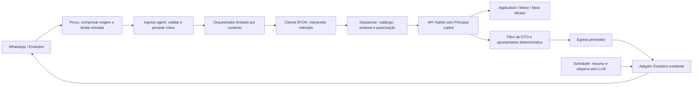

# Arquitetura proposta — Assistente de trabalho do Credor

**Identificador local:** `agentic-arquitetura-capacidades-2026-09-09`

**Data:** 2026-09-09

**Versão:** 1.1.0

**Status:** Aprovado pelo proprietário em 2026-09-09 para detalhamento e execução pelo plano aplicável; não fecha GATE-E nem autoriza produção.

**Workflow / classificação:** `architect` / `ARCHITECTURAL`

**Impacto agentic:** `PRESENT` — ferramentas, contexto, autorização, limites de execução e avaliação.

**Responsável:** coordenação Codex; revisão `ai_architect` somente leitura pelo OpenCode Harness.

## 1. Contexto, objetivo e autorização

O proprietário autorizou continuar para Architect após o [discovery de capacidade](../../audits/discoveries/agentic-capacidade-potencial-2026-09-09.md). Este documento transforma a direção recomendada em uma proposta revisável: começar por consultas confiáveis no WhatsApp e evoluir para preparação de trabalho na plataforma. O domínio continua determinístico e o Credor continua decidindo.

O escopo desta sessão é documentação de arquitetura e revisão, com preservação de todas as alterações anteriores. Nenhuma autorização de implementar, alterar prompts, liberar gates ou publicar foi inferida de “vamos seguir”. O [PLAN-033](../../implementation/plans/PLAN-033-copilot-tianet.md), seu [backlog](../../implementation/backlogs/PLAN-033-execution-backlog.md), a [DR-005](../../governance/decision-requests/DR-005-pii-modelo-e-teto-de-custo-do-copilot.md) e a [DR-004](../../governance/decision-requests/DR-004-base-e-acumulacao-dos-juros-e-fim-do-plano-de-parcelas.md) permanecem governantes.

**Decisão proposta:** adotar o assistente de trabalho como direção, mantendo a ordem de pré-requisitos do PLAN-033. O primeiro catálogo contém seis ferramentas de leitura. O modelo interpreta intenção e solicita ferramentas permitidas; respostas financeiras são construídas por apresentadores determinísticos. A expansão para cockpit, rascunhos, PreCadastro e comandos tem fronteiras explícitas e não entra por ampliação silenciosa desse catálogo.

Não se propõem novos provedores, SDKs, broker, banco vetorial, RAG, framework multiagente ou memória longa. A infraestrutura e o cliente BYOK via `httpx` já previstos são suficientes para esse recorte. Não há recomendação de modelo novo nem afirmação de qualidade do modelo escolhido pelo cliente, cuja identificação ainda precisa ser registrada.

### Fatos, hipóteses e desconhecidos

- Fatos verificados: seis rotas candidatas e seus DTOs existem; não há serviço agent, inbox conversacional ou PreCadastro no código. GET de quitação compartilha permissão de execução; criar simulação persiste por POST. O provedor não deduplica envio por ID. Referências e evidências E01–E12 estão no discovery.
- Hipótese de produto: consulta simples e rastreável entrega valor antes de texto financeiro livre; preparação de trabalho tende a ter mais valor que ampliar indiscriminadamente a API. O Credor ainda não comparou essas jornadas num piloto.
- Desconhecidos operacionais: origem do webhook em produção, prontidão do IMP-359, modelo/base URL exatos, volumes e tempo máximo das consultas. Nenhum deles é declarado resolvido por este desenho.
- Proposto, não existente: tabelas do agente, registros do catálogo, referências opacas, apresentadores e contratos desta arquitetura.

## 2. Alternativas e recomendação

| Escolha material | Alternativa | Benefício | Custo/risco | Recomendação e condição de revisão |
|---|---|---|---|---|
| Produto | Chat de leitura estrito do PLAN-033 | Menor recorte novo, canal conhecido | Não prepara jornadas completas | Base inicial; medir valor contra UI atual |
| Produto | Assistente de trabalho com cockpit e rascunhos | Menos busca e repetição; conferência visual | Novos contratos de rascunho e integração UI | Direção proposta, por expansão formal posterior |
| Produto | Orquestrador geral de comandos | Menos entrada manual | Autoridade excessiva, encadeamento e efeitos difíceis de desfazer | Rejeitado para v1; comandos isolados só após benefício e controles demonstrados |
| Resposta financeira | Prosa livre do LLM com verificador posterior | Flexibilidade | Verificar números não prova a relação ou conclusão afirmada; comparações podem mentir usando números corretos | Rejeitada no primeiro catálogo |
| Resposta financeira | Intenção/tool-use pelo LLM e apresentação determinística | Valores, relações e linguagem financeira testáveis | Menos liberdade; novos apresentadores para novas perguntas | Escolhida como proposta; ampliar prosa explicativa só com avaliação específica |
| Acesso a dados | SQL direto ou importação do Motor pelo agente | Menos salto de rede | Contorna API/RBAC, acopla domínio e operação de IA | Rejeitado |
| Acesso a dados | API autenticada com identidade mínima própria | Reusa contratos, erros e autorização existentes | Latência e limites de consultas precisam de controle | Escolhido; não compartilhar credencial do humano |
| Monitoramento | Event Bus/consumidores novos desde o início | Reação imediata | Transporte/checkpoint não estão entregues nesse plano | Adiado; [ADR-005](../adrs/ADR-005-event-bus-interno-eventos-dominio.md) não implica entrega durável ativa |
| Monitoramento | Snapshot e jobs determinísticos existentes | Menos infraestrutura, comportamento reproduzível | Atualidade vinculada ao ciclo; snapshot em memória não é histórico durável | Base para resumo/véspera; novos monitores precisam de fonte/limiar/checkpoint explícitos |

Simplicidade e testabilidade favorecem API + catálogo fechado + apresentação determinística. A manutenção cresce por ferramenta/jornada, com schema e teste próprios. O custo de inferência fica concentrado em compreender pedidos; nenhuma chamada LLM é necessária para relógio, cálculo ou envio programado. O benefício de uma ferramenta nova deve superar o custo de schema, operação e avaliação.

## 3. Fronteiras e arquitetura alvo

O diagrama é proposta lógica; não representa serviços implementados. A seta para o adapter passa sempre pela política de intenção, tentativa, consentimento aplicável e resultado incerto. Scheduler não ganha permissão de ler conversas.

| Componente / owner | Responsabilidade | Autoridade negada |
|---|---|---|
| Proxy e ingress / operação do agente | Provar origem, limitar bytes, descartar eventos não suportados, reconhecer instância confiável, gravar entrada antes do ACK | Não interpretar `Sender` forjado como identidade; nenhuma escrita de crédito |
| Resolvedor de contexto / aplicação agent | Fixar Tenant, Carteira, instância, remetente normalizado e classe; obter Principal de serviço | Modelo não escolhe escopo, papel ou destinatário |
| Orquestrador / aplicação agent | Processar uma entrada com orçamento finito, serializar sessão, registrar resultados e dedupe | Não é loop geral de planejar/agir; não decide negócio |
| Cliente LLM / infraestrutura agent | Usar modelo/base URL fixados e validar resposta contra contrato | Sem fallback automático, rede livre ou administração do sistema |
| Catálogo/dispatcher / aplicação agent | Validar nome, argumentos de negócio, permissão e vínculo; montar URL fixa | Sem proxy HTTP genérico, wildcard de rota, SQL ou ferramenta de shell |
| API/Application/Motor / TiaNet | Autorizar acesso e calcular fatos financeiros oficiais | Agente não importa repositório/Motor nem escreve suas tabelas |
| Filtro e apresentador / aplicação agent | Validar DTO, contexto, data e completude; emitir texto fixo a partir de campos permitidos | Sem soma/arredondamento financeiro novo, interpretação de projeção ou conclusão inventada |
| Egress / aplicação agent e adapter existente | Persistir intenção e resultado; enviar ao destinatário autenticado da entrada | ID de envio não é garantia de dedupe do provedor; não reenviar resultado incerto |
| Plataforma/BFF / frontend futuro | Conferir fatos e rascunhos na sessão humana | UI não delega o token humano ao agente nem aprova pelo simples clique em um link |

**Duas classes, como no plano:** Operadora e PreCadastro. Antes do IMP-357, o contexto desconhecido só recebe resposta fixa de capacidade indisponível, sem coletar/processar cadastro inexistente nem consultar carteira. Depois do IMP-357, recebe apenas a ferramenta específica de criação de pendência, com confirmação do remetente. Devedor conhecido não vira classe autenticada adicional por corresponder a um telefone cadastrado.

Se a origem não puder ser comprovada, Operadora fica desabilitada em fail-closed, ainda que `Sender` esteja na allowlist. IP/controle de rede só vale se comprovado na topologia real; não inventar segredo assinado que o provedor não suporta. O desenho de rede é evidência do IMP-359, não suposição de arquitetura.

## 4. Primeiro catálogo nominal — proposta para resolver B1

Versão lógica proposta: `consulta_operadora_v1`. Todas as ferramentas abaixo pertencem exclusivamente à Operadora e são leituras de negócio. O perfil mínimo necessita `devedor.ler`, `motor.saldo.ler` e `relatorios.operacionais.ler`. Login/refresh e obtenção de contexto são operações internas do cliente, não ferramentas do modelo. Perfil/seed deve ser validado conforme IMP-355 antes da habilitação.

Schemas devem recusar campos extras. Datas usam formato ISO e calendário válido. Dinheiro é decimal tipado em string no contrato do agente; nenhuma conversão para float. Nenhum argumento do modelo contém `tenant_id`, `carteira_id`, `usuario_id`, permissão, URL, destinatário ou credencial. Referências opacas só resolvem no contexto/sessão de origem.

| Nome nominal | Entrada permitida ao modelo | HTTP interno fixo e permissão | Campos de saída permitidos ao apresentador |
|---|---|---|---|
| `localizar_devedor` | `nome` textual, 1–200 caracteres; sem documento/telefone livre no primeiro contrato | GET `/credit/carteiras/{carteira_id}/devedores`, `devedor.ler`; aplicação fixa página/tamanho | `ref`, `nome`, `estado`, `documento_mascarado` para desambiguação; total/completude validados. UUID, documento integral, contatos e timestamps cadastrais não passam ao modelo |
| `consultar_saldo_devedor` | Somente `devedor_ref` emitida pelo resolvedor; data atual injetada pelo servidor | GET `/credit/devedores/{devedor_id}/saldo`, `motor.saldo.ler` | `principal`, `juros`, `encargos`, `total`, `emprestimos_considerados`, `data_referencia`; itens podem ser exibidos pelo apresentador com referências, sem recálculo |
| `consultar_resumo_carteira` | Objeto vazio; data atual injetada pelo servidor | GET `/credit/carteiras/{carteira_id}/relatorios/resumo`, `relatorios.operacionais.ler` | `total_operacoes`, `operacoes_ativas`, `operacoes_quitadas`, `acertos_pendentes`, `principal_a_receber`, `total_realizado`, `data_referencia`; **excluir `projecao_juros`** |
| `consultar_acertos` | Objeto vazio; data atual injetada pelo servidor | GET `/credit/carteiras/{carteira_id}/relatorios/vencimentos`, `relatorios.operacionais.ler` | `total`, itens com referências, `dia_de_acerto`, `acerto_em`, `dias_sem_pagamento`, `principal_original`, `situacao`; data de referência |
| `consultar_pagamentos_periodo` | `inicio`, `fim` | GET `/credit/carteiras/{carteira_id}/relatorios/pagamentos`, `relatorios.operacionais.ler` | Pagamentos com referências, `recebido_em`, `valor_recebido`, `estado`; referências de `operacoes_quitadas`, `total_realizado`, início/fim |
| `consultar_fluxo_realizado` | `inicio`, `fim`, nunca posteriores ao dia atual | GET `/credit/carteiras/{carteira_id}/relatorios/fluxo`, `relatorios.operacionais.ler` | Itens com `data`, `realizado` e referências de pagamentos; início/fim. Excluir `acertos` desse apresentador inicial, além de não inventar total geral ou previsto |

Fontes diretas: [Devedor DTO](../../../src/emprestimo/presentation/api/devedores_schemas.py), [rotas cadastrais](../../../src/emprestimo/presentation/api/devedores_routes.py), [rotas Motor](../../../src/emprestimo/presentation/api/motor_routes.py), [schemas operacionais](../../../src/emprestimo/presentation/api/operacao_diaria_schemas.py), [rotas operacionais](../../../src/emprestimo/presentation/api/operacao_diaria_routes.py) e [IAM](../../../src/emprestimo/application/iam_catalogo.py).

### Seleção de entidade, datas e completude

`localizar_devedor` usa busca nominal paginada existente. Se não houver resultado, responde não localizado; se houver mais de um, a aplicação apresenta opções e exige seleção explícita antes do saldo. Não escolher primeiro resultado por similaridade. Referência expirada ou de outra sessão é inválida. Cada uso reconfirma vínculo cadastral e permissão; nomes não são chave de cache ou autorização. Consulta por documento pode ser adicionada depois com decisão própria, não por passar argumento extra à rota atual.

“Hoje” é resolvido pelo relógio e fuso operacional confiável do contexto, nunca pelo modelo; o apresentador sempre mostra a data absoluta. Datas relativas complexas ou ambíguas exigem esclarecimento. Fuso ausente não pode ser substituído silenciosamente por UTC. Intervalos de pagamentos/fluxo são inclusivos conforme contrato da API, validados antes da chamada; `inicio > fim` ou `fim` futuro são recusados. Não há inferência de período a partir de histórico não confiável.

**Limite temporal confirmado no código:** `resumo_carteira` usa estados atuais e pagamentos sem corte histórico para seus totais; `vencimentos_inadimplencia` seleciona empréstimos atualmente ativos; `consultar_por_devedor` soma empréstimos atualmente ativos, não os que estavam ativos na data pedida. Portanto, saldo/resumo/acertos do primeiro catálogo aceitam só posição atual, com a data injetada pela aplicação. Pedido “quanto devia naquele mês?” não é silenciosamente convertido em hoje: responde limitação e encaminha à conferência humana. Não se altera a API existente por essa restrição do catálogo.

Pagamentos e fluxo filtram datas de recebimento, mas respeitam o estado de estorno/encerramento observado agora. O apresentador diz “registros do período, conforme consulta em [instante]”, sem prometer o que o sistema sabia no fechamento histórico. O campo `acertos` de fluxo é calculado sobre operações atualmente ativas e fica fora desse apresentador para evitar uma série histórica aparente. Fontes adicionais: [implementação dos relatórios](../../../src/emprestimo/application/relatorios.py), [consulta agregada](../../../src/emprestimo/application/motor_financeiro.py) e [estado do empréstimo](../../../src/emprestimo/domain/credit/emprestimo.py).

A resposta interna inclui metadados produzidos pelo adapter do agente: `tool_version`, `call_id`, `fetched_at`, parâmetros canônicos, proveniência e `completeness`. Esses campos **não existem por suposição na API atual**. Completude significa que o resultado publicado daquela chamada foi validado, não que várias consultas representam snapshot transacional único. Consultas de momentos diferentes aparecem separadas; não gerar comparação monetária ou consolidado entre elas.

Para desambiguação, limitar as opções exibidas e pedir refinamento quando a listagem não couber; nenhuma primeira página é tratada como conjunto completo. Para relatórios, resultado além do limite de apresentação gera resposta fixa para abrir a plataforma/refinar período, sem truncar e chamar de total. Se houver total oficial junto a itens parciais, a primeira versão não o apresenta como relatório completo; retornar recusa de capacidade evita ambiguidade.

### Saída do LLM e apresentação financeira

O modelo devolve uma intenção validada ou uma solicitação de ferramenta da allowlist. Após a consulta, recebe apenas metadados mínimos de sucesso/necessidade de esclarecimento, referências autorizadas e tipos de resultado necessários ao fluxo. Os valores financeiros ficam no registro validado da aplicação e são apresentados diretamente. A DR-005 permite PII/valores no prompt Operadora, mas não obriga transmiti-los quando a tarefa é resolvida sem isso.

Não aceitar prosa livre do modelo como resposta financeira no primeiro recorte. O código escolhe o apresentador pela ferramenta executada e resultado observado. A resposta contém rótulos fixos e campos oficiais: por exemplo, `principal_a_receber` é “principal a receber”, nunca “saldo total”, e `total_realizado` não é chamado de lucro. Erro, ausência, negativo permitido ou zero oficial preservam a semântica da API; 404 não vira saldo zero. Formatar decimal para exibição não recalcula, arredonda ou soma valores.

Isso impede também uma falsidade relacional como “o saldo caiu” usando dois números corretos de datas não comparáveis. Pergunta não suportada, projeção, recomendação financeira ou pedido de nova conta recebem resposta fixa de limitação e encaminhamento humano. Memória de cálculo e explicações mais livres ficam para catálogo posterior com avaliação própria.

### Exclusões verificáveis

Sem `motor.quitacao.executar`, qualquer escrita financeira, criar simulação, proposta/contrato, IAM/configuração, retry/conciliar ou envio arbitrário no catálogo. Ausência no catálogo e no perfil deve ser provada por testes de chamada, não só descrita em prompt. Egress da resposta é uma operação interna governada pelo contexto, não ferramenta de destinatário/texto livre concedida ao LLM.

## 5. Persistência, concorrência e recuperação

Proposta: tabelas próprias do agente no PostgreSQL já previsto, com migrations aditivas/reversíveis e credencial restrita às tabelas do agente. O agente usa HTTP para dados do produto; acesso ao seu armazenamento não concede leitura direta de Devedor, Pagamento ou Motor. Compartilhar o servidor de banco não transfere ownership. Nomes físicos e DDL serão definidos no plano, sem reutilizar `Sessao` IAM ou `RegistroComunicacao` como conversa.

| Registro lógico | Chave/relacionamento | Conteúdo e ciclo de vida propostos |
|---|---|---|
| Inbox | Única `(instance_id, provider_input_id)`; instância resolvida de configuração confiável | Texto/metadados minimizados após descarte de mídia; recebido, em processamento, concluído, falha terminal; ACK só após commit |
| Sessão conversacional | Tenant + instância + classe + remetente normalizado; Principal/contexto revalidados | Estado de desambiguação e referências com validade; exclusão aos 90 dias; sem promoção automática de classe |
| Execução de entrada | Inbox + tentativa/lease/fencing | Orçamento, checkpoints e desfecho; serialização por sessão para impedir resposta fora de contexto; worker obsoleto não finaliza |
| Tool call | Entrada + índice estável + versão da ferramenta | Parâmetros canônicos protegidos, resultado filtrado e proveniência; resultado persistido antes de avançar para resposta |
| Egress | Entrada + índice estável de saída; hash do payload | Destinatário resolvido pelo servidor, texto já renderizado, estado preparado/em envio/aceito/falha/desconhecido; intenção persistida antes do efeito |

Payloads/resultados necessários para recuperação permanecem em armazenamento de aplicação protegido e com expurgo, não em logs/telemetria. Logs contêm somente IDs/códigos/versões/contagens permitidos; não prompt, corpo de ferramenta ou conteúdo integral. A [ADR-002](../adrs/ADR-002-auditoria-independente-da-transacao.md) continua separada: GET não cria trilha financeira, tool-call tem trilha própria.

### Casos de crash e replay

1. Antes de gravar inbox: sem ACK de aceitação; depender do retry limitado do provedor, sem alegar replay infinito. Evento repetido após commit encontra a mesma inbox e não inicia outra conversa.
2. Durante inferência: checkpoint/lease impede concorrência, mas crash após o provedor de IA responder e antes do commit local pode perder o resultado. Não alegar exatamente uma cobrança de inferência: resultado incerto não é reemitido automaticamente; encerrar com falha segura após recuperação, registrando consumo desconhecido quando não mensurável.
3. Durante GET: leitura não escreve negócio; se não existe resultado persistido, recuperar por nova consulta somente sob orçamento definido e registrar nova referência temporal. Resultado salvo pode completar a resposta original com sua data; nova mensagem do usuário consulta de novo, sem reutilizar saldo antigo como atual.
4. Depois de renderizar e antes de enviar: reutilizar egress preparado e payload idêntico, sem nova inferência. Claim/fencing local impede dois executores iniciarem a mesma intenção, respeitando o limite abaixo.
5. Depois de transmitir ao Evolution e antes de persistir aceite: marcar desconhecido. Lease expirado, nova confirmação ou chave repetida não provam não aceite. Não reenviar automaticamente, pois o provedor não deduplica. O fencing do banco não cancela requisição já transmitida.
6. Resposta parcial em mais de uma mensagem: índices únicos, estados independentes e recuperação sem repetir trechos aceitos/incertos. Recomenda-se apresentação em uma mensagem dentro de limite configurado; resultado maior encaminha à plataforma. Não adicionar “concluído” se parte do envio ficou incerta.

Dedup de entrada não garante dedup externo depois de 90 dias de expurgo. Não habilitar replay histórico/importação de conversa nesse recorte. Tratamento de entradas antigas, restauração de backup e possível reapresentação de IDs expirados deve ser testado e documentado no plano; não ampliar retenção sem decisão. O próprio contrato do Evolution tem janela limitada de retry e não oferece replay, conforme contexto externo.

## 6. Limites, erros, privacidade e observabilidade

Limites são parâmetros operacionais propostos para especificação e aprovação no plano; **não há números implementados ou escolhidos silenciosamente nesta sessão**. A configuração final não pode ter valor infinito/default permissivo. Deve falhar ao iniciar a capacidade quando faltar um limite obrigatório.

| Dimensão | Controle e check requerido |
|---|---|
| Ingress | Limite de bytes no proxy/aplicação compatível com descarte de HistorySync do PLAN-033; descartar mídia antes de persistir; envelope sem ID/classe suportada não vai ao LLM |
| Inferência | Máximo de etapas/chamadas por entrada, tokens de entrada/saída, deadline total, timeout individual e concorrência; tentativa incerta não reinicia loop |
| Rate limit | Por instância/remetente/classe e global; desconhecidos com quota menor e capacidade reservada à Operadora; teste distribuído/concorrente |
| Consultas | Janela temporal máxima, quantidade de opções/itens, bytes de resposta, timeout HTTP e orçamento de chamadas; limitar antes de parsing/apresentação |
| Custo de backend | DTO pequeno ou timeout HTTP não limitam o trabalho no banco. Os relatórios atuais podem percorrer toda a carteira e resumo calcula projeção mesmo quando o adapter a remove. Medir sob volume sintético e estabelecer orçamento/limite no backend ou impedir habilitação da ferramenta; não certificar apenas o wrapper |
| Atualidade | Referências de seleção expiram; data/fetched_at visíveis; revalidar acesso a cada chamada e antes de egress; não afirmar snapshot global entre endpoints |
| Segurança | Autorização recusada encerra; refresh controlado, revogação/401 sem loop; classificar errors sem vazar existência de outro escopo |
| Degradação | Falha de API/LLM/schema/budget produz resposta fixa; falha de egress produz estado operacional, não outra tentativa de enviar aviso pelo mesmo canal incerto |

**Invariantes mecânicas:** registro fechado de tools, schema `extra=forbid`, perfil sem permissões mutáveis, URLs constantes, referências escopadas, índice único de inbox/egress, claim/fencing, apresentadores financeiros fixos, resultado desconhecido terminal para retry automático, expurgo de 90 dias e limites de execução obrigatórios.

**Permissão antes da resposta:** se a identidade/permissão for revogada após a consulta, cancelar egress ainda não transmitido. Não se pode recolher uma mensagem já entregue; janela residual entre última verificação e efeito externo deve ser explícita. Nada de cache compartilhado de resultados entre classes ou remetentes.

**Privacidade:** DR-005 mantém 90 dias para inbox/sessão/mensagem/tool-call; o egress conversacional é mensagem e acompanha esse expurgo. Não modificar auditoria financeira append-only. Resultado bruto da API é filtrado antes de persistência do agente; CPF integral/contatos não pertencem à busca nominal proposta. Nome e texto do usuário ainda podem conter PII autorizada e instruções maliciosas; são dados, nunca política. Operadora e PreCadastro não compartilham contexto, cache, tool-call ou resposta.

**Métricas:** idade/backlog de inbox, dedupe, descarte, latência por etapa/tool, erro de schema/API/IA, recusa de autorização, consumo conhecido/desconhecido, custo estimado, quota, erro de refresh, estado egress, expurgo e recuperação. Não há teto mensal em moeda nem fallback de modelo/provedor, conforme DR-005. Alarmes devem ser por limiar e mudança relevante, sem mensagem por ciclo.

### Precisões incorporadas pela revisão

- Evento sem identificador obrigatório é descartado com resposta 2xx e métrica de motivo, sem inbox tratável, inferência ou ferramenta. Esse reconhecimento de descarte não representa aceite de processamento; para entrada tratável, o ACK continua posterior ao commit. Não inventar identidade por hash do texto.
- Normalização aceita somente formato de telefone/JID explicitamente suportado pelo contrato do provedor, após prova de origem e instância. Não converter dígitos de LID em telefone. Grupo e mensagem própria são descartados; identidade não resolvida nunca ganha acesso Operadora.
- Referência opaca tem expiração curta própria, obrigatória na configuração a detalhar em Plan; não herda os 90 dias de retenção. Vincular à seleção pendente, principal, sessão e classe; invalidar por expiração, mudança de contexto, revogação ou expurgo, com autorização revalidada a cada uso.
- Formatação financeira pode acrescentar zeros e separadores locais preservando exatamente o decimal. Casas adicionais não nulas são preservadas ou recusadas pelo apresentador quando não suportadas; não arredondar para caber em duas casas.
- Hash de egress cobre serialização canônica versionada do payload renderizado e do vínculo servidor: tenant, carteira quando aplicável, instância, classe, principal, destinatário normalizado, entrada do provedor, índice da saída, versão da ferramenta e call-id quando houver. A mesma chave com conteúdo ou contexto divergente termina em conflito, sem envio. Plan especificará encoding/canonicalização e vetores de teste; credenciais não integram o material.
- Limites numéricos, TTL e orçamento efetivo do backend são entregáveis obrigatórios de Plan antes da implementação/habilitação correspondente. Aprovar a direção arquitetural não aprova valores ainda ausentes.

## 7. Evolução de interface, rascunhos e comandos

O primeiro catálogo atua no canal do plano. A plataforma existente continua sendo destino para relatórios extensos e trabalho humano. Links são montados pelo servidor para rotas conhecidas; não carregam token, CPF, dados financeiros ou comando executável em query string. Abrir a plataforma exige sessão humana normal e revalidação do contexto pelo BFF.

Allowlist inicial proposta de links: `/app/relatorios`, `/app/devedores` e `/app/motor`, sem query string, combinados com origem fixa de configuração do servidor. Não aceitar href do modelo nem criar deep-link de entidade sem contrato verificado em ciclo posterior.

**Expansão cockpit:** adicionar leitura de fila/agenda/memória/histórico por novo catálogo, com permissões/esquemas próprios. Exibir fonte, data e motivo de seleção; ordenação por regra do produto, sem scoring de crédito. Nenhuma criação de painel nesta sessão.

**Rascunho proposto:** estrutura tipada para compromisso/ação/comunicação com campos informados, faltantes e referências. Não é escrita de domínio nem ordem executável. A primeira expansão deve entregar o rascunho ao formulário humano sem confirmação remota. Qualquer persistência de rascunho requer schema, ownership, expiração e retenção decididos explicitamente; não herdar prazo de intenção executável por semelhança.

**PreCadastro:** permanece o Aggregate novo do IMP-357 com pendente/aprovado/rejeitado. Remetente confirma dados mascarados para criar pendência; somente Credor decide e cria Devedor por caso de uso idempotente. Implementar D não depende do cockpit: pode seguir C conforme o plano vigente. Recomendação de prioridade entre cockpit e captação deve ser confirmada pelo proprietário antes do plano dessa expansão.

**Comandos futuros:** compromisso e registro de ação são os primeiros candidatos, depois de rascunhos avaliados. Exigem intenção canônica persistida, hash, identidade de proponente e decisor, validade, estado/versão de recurso, confirmação explícita ligada à intenção e revalidação transacional antes de efeito. Alterar campos/permissão/estado exige nova conferência. Replay converge; sucesso só após resultado persistido. Pagamento, estorno, quitação, renegociação, lançamento e decisão comercial continuam fora do v1 agentic. Confirmar não substitui evidência externa de notificação.

## 8. Infraestrutura, rollout e rollback

Manter a topologia existente prevista no PLAN-033: processo agent separado no mesmo repositório/compose, PostgreSQL, API privada e integração Evolution já escolhida. Não criar webhook público na API TiaNet. Configuração de instância/tenant/allowlist e segredos é do servidor; variável BYOK não pode ser sobrescrita por mensagem. Isolar credencial de dados do agente de credencial/API do copilot e do usuário humano. A [ADR-003](../adrs/ADR-003-escopo-single-tenant-do-v1.md) mantém um operador humano, sem suprimir isolamento de escopo.

Ordem para planejamento, sem nova numeração de IMP:

1. Aprovar as decisões propostas e reconciliar catálogo/entregas afetadas no PLAN-033/backlog, com pré-voo e rito aplicáveis.
2. Concluir IMP-359 e demonstrar GATE-E1b antes de IMP-353/354; concluir pré-requisitos B/autoria/saldo conforme dependências existentes. Preservar resumo e véspera sem LLM.
3. Planejar/implementar IMP-356 A–F com schema, limites e provas desta arquitetura após aprovação aplicável. Habilitar primeiro em cenário sintético; nenhum “shadow” com dados reais sem autorização de tratamento/ambiente.
4. Liberar somente ferramentas certificadas por versão/configuração após todas as seis entregas; subset temporário precisa estar declarado no plano e não fecha B1 por omissão. Testar recusas e restauração, não apenas transcript feliz.
5. Pilotar tarefas autorizadas, medir tempo/esforço de revisão/recusa correta/precisão, comparando com UI e automação determinística. Critérios numéricos e amostra precisam constar do plano antes de executar piloto.
6. Planejar PreCadastro conforme dependência C→D e expansão cockpit em ciclo próprio; não misturar aprovação do núcleo com comandos futuros.

Rollback: desabilitar o contexto/tool, revogar a credencial de serviço quando apropriado, parar novos claims, drenar com prazo e manter egress incerto sem retry. UI humana permanece. Migrations são aditivas e downgrade é reversível estruturalmente, mas não usar downgrade destrutivo como primeiro rollback: preservar inbox/egress para recuperação dentro da retenção. Restore deve impedir reenvio de intenções que podem ter sido aceitas após o ponto do backup. Não recolher mensagens nem prometer apagar dados já enviados ao fornecedor.

## 9. Avaliação e portas

Todos os checks abaixo são exigências propostas para o plano de produto; não foram executados nesta sessão documental.

| Requisito | Evidência/checagem necessária | Porta |
|---|---|---|
| Origem e classe | Spoof/LID/grupo/IsFromMe/instância não reconhecida nunca chamam tools de carteira; ACK após persistência | IMP-359 e 356-A |
| Catálogo mínimo | Seis nomes exatos; argumentos extras, URL, destinatário e tool desconhecida recusados; permissões financeiras ausentes | B1 / 356-D |
| Identidade/seleção | Homônimos, página incompleta, referência expirada/de outra sessão, vínculo inválido, acesso revogado | 356-D/F |
| Dinheiro | Números e rótulos vêm do apresentador; LLM não altera valor/relação; 404≠zero, principal≠saldo, realizado≠lucro, projeção ausente; data antiga não vira posição histórica nem consulta atual silenciosa | 356-D |
| Completude/tempo | Carteira sintética maior que uma página; intervalos/data/fuso; API parcial, resposta excedida, dados de momentos distintos | 356-D e avaliação de capacidade |
| Operação limitada | Rajada concorrente; orçamento de etapa/tokens/tempo; consulta lenta continua onerando backend; limite efetivo ou tool desabilitada | 356-B/C/D |
| Crash/replay | Antes/depois de inbox, IA, GET, resultado salvo e envio; claim antigo não finaliza; inferência incerta não reinicia automaticamente | 356-A/E/F |
| Egress | Canal sem dedupe, timeout/5xx/2xx malformado; nenhuma repetição de resultado incerto; aceite não vira entrega | 356-E |
| Expurgo/restore | Retenção de 90 dias, referências inválidas após expurgo, backup antigo não duplica envio, logs sem conteúdo | 356-F/359 |
| Degradação | API/LLM indisponível, 401/revogação, schema inválido; resposta fixa e ausência de loop/fallback | 356-C/D/F |
| Valor | Tarefas pareadas, correções, tempo e clareza; critérios previamente definidos com Credor | Piloto e expansão |

**Estado das portas após decisão do proprietário em 2026-09-09:** o catálogo B1 foi aceito com as seis ferramentas, três permissões e apresentação determinística desta arquitetura; G3/G4 do ciclo local estão satisfeitos por este registro e pela aprovação explícita do [plano de execução](../../governance/agents/agentic-plano-execucao-2026-09-09.md). GATE-E1b e GATE-E3 continuam abertos: dependências, implementação, certificação e operação ainda exigem evidência. Nenhum parecer especializado fecha esses gates.

## 10. Minuta de decisão para governança

Esta seção segue o conteúdo do [template de ADR do produto](../../templates/adr-template.md), sem emitir número, reservar namespace ou alterar ADR existente. É uma minuta proposta para a reabertura controlada; emissão formal segue [SPEC-002](../../governance/SPEC-002-governance-identifier-system.md), não inferência de “próximo número”.

**Título:** Catálogo mínimo do copilot e apresentação determinística de fatos financeiros.

**Status:** Aprovado em 2026-09-09. **Autor:** coordenação de arquitetura. **Revisor:** AI Architect Senior. **Aprovação:** proprietário, pela aprovação explícita do plano v1.4.0 que incorpora esta minuta. **Substitui:** nenhuma decisão anterior; especializa o catálogo B1 dentro do PLAN-033/DR-005.

**Contexto/problema:** APIs já existem, mas o catálogo B1 não está definido. Texto financeiro livre e GETs com permissões mutáveis podem ultrapassar a intenção do v1.

**Decisão:** aceitar as seis ferramentas da seção 4, três permissões mínimas, exclusão de projeção/quitação/simulação e apresentação financeira determinística. Manter HTTP autenticado, isolamento por classe, retenção vigente, proatividade sem LLM e expansão por catálogo/jornada. O LLM interpreta pedidos, sem calcular ou decidir.

**Justificativa:** satisfaz consultas úteis com enforcement mecânico e mantém espaço para expandir sem conceder autorização genérica. A limitação de prosa é deliberada e mensurável; caso as tarefas não sejam resolvidas, reavaliar o catálogo e apresentadores, não contornar controles via prompt.

**Consequências:** maior previsibilidade, menor liberdade textual e custo de manter apresentadores; API existente pode exigir otimização/limites antes de habilitar relatórios. Desligar tools é reversível para novos pedidos, mas dados enviados e efeitos externos não se desfazem.

**Alternativas consideradas:** seção 2. **Implementação:** seção 8 orienta Plan, sem novo backlog ou prazo inventado. **Métricas/validação:** seção 9 e metas de piloto a definir. **Revisão:** ao fim do piloto ou mudança de modelo/escopo/semântica. **Condições de reversão:** erro financeiro, acesso indevido, duplicação ou custo de revisão superior ao ganho; desabilitar capacidade e investigar.

### Decisões concretas para o proprietário

| Decisão proposta | Consequência se aprovada | Se não aprovada |
|---|---|---|
| Seis ferramentas e três permissões da seção 4, projeção excluída | Plan pode detalhar B1 e schemas desse recorte, respeitando gates | Revisar lista/campos antes de Plan do 356-D |
| Interpretação por LLM, resposta financeira determinística | Primeira conversa tem alcance explícito e não produz explicação financeira livre | Exige outro desenho de avaliação/controle de prosa antes de implementação |
| Cockpit/rascunhos como evolução, C→D preservado | Núcleo pode ser planejado agora; prioridade das expansões decidida depois | Manter PLAN-033 estrito sem comprometer contrato inicial |

Não é necessário decidir agora scoring, RAG, novo canal, autosserviço do Devedor ou comandos financeiros. Aprovar esta arquitetura não equivale a concluir IMP-359, aceitar risco de webhook ou autorizar deploy.

## 11. Evidências, revisão e handoff

Baseline da sessão capturado antes deste documento: HEAD destacado `6ae2f685e754259e46c7489b770e2be3f0b108ea`, alterações anteriores e discovery preservados. Conferência do grafo: o índice AST foi atualizado no discovery nesta mesma conversa; hashes das fontes de produção continuam idênticos. O detector ainda lista 235 entradas de código (amostra inclui JSON/PowerShell), 306 documentos e 50 imagens; não se declara cobertura semântica completa. Consultas pontuais `graphify explain 'RelatoriosOperacionaisService'` e `graphify explain 'ConsultaSaldoService'` mostraram 19 e 16 conexões, sem truncamento; rotas/DTOs/permissões foram conferidos diretamente. Limite SQL e camada documental defasada permanecem os registrados no discovery; nenhuma ausência foi inferida apenas do grafo.

O pré-voo cobre módulos (agente proposto e adapters), API (seis GETs existentes, contratos internos novos), persistência (tabelas próprias propostas), segurança (perfil/contexto/egress) e documentação (PLAN-033/DRs/ADRs). Operação externa permanece responsabilidade do IMP-359. Achados adicionais que condicionam o desenho: remover projeção no filtro não evita o cálculo custoso feito pelo backend; desempenho precisa ser medido antes da habilitação. Datas de referência não reconstruem por si só estados passados: posição atual foi separada de registros por período na seção 4.

A revisão `ai_architect` usou OpenCode Harness, modelo `opencode/muse-spark-1.3-contributor-free`, agente `plan`, política `READ_ONLY`, task `9824bd5b-710f-48f7-a109-f11f05ac34e7`. O pacote temporário continha somente cópias sanitizadas do design/discovery, sem dados reais, segredos ou conversas; links ao checkout não foram seguidos. O especialista avaliou o pacote; conferência das fontes e hashes é evidência da coordenação, não do executor externo.

Na tentativa 1, o especialista declarou `APPROVED` para prontidão documental a Plan, com cinco concerns e três sugestões, sem blocker. A coordenação registrou `CORREÇÃO` para incorporar precisões e o achado temporal independente antes da revisão final:

| Achado | Reconciliação |
|---|---|
| R-01 — descarte/ACK sem ID | Resolvido: 2xx de descarte sem processamento. Alternativa de fabricar dedupe por hash rejeitada; não substitui identificador obrigatório nem aceita trabalho sem persistência. |
| R-02 — validade de referência | Resolvido no desenho: prazo próprio curto e invalidação por contexto; valor e provas obrigatórios em Plan, separado da retenção. |
| R-03 — exibição decimal | Sugestão de permitir arredondamento rejeitada: separador e zeros preservam valor; precisão adicional não nula exige preservação ou recusa. |
| R-04 — hash de egress | Resolvido: vínculo contextual e payload versionados, divergência terminal; canonicalização e vetores ficam explicitamente em Plan. |
| R-05 — identidade | Resolvido: formato suportado, origem/instância, descarte de grupo/própria e proibição de inferir telefone por LID. |
| R-06 — links | Resolvido: três rotas fixas conferidas em páginas atuais do frontend, origem servidor e sem query. |
| R-07 — limites | Incorporado: números, fail-fast e orçamento efetivo de backend são obrigações do plano, sem inventar valores nesta arquitetura. |
| R-08 — escopo da evidência | Incorporado: revisão sanitizada e conferência local são evidências distintas. |

A tentativa 2 concluiu em 74.072 ms com `APPROVED` para seguir a Plan, confirmando as restrições temporais e as seis precisões. O Harness observou zero arquivos alterados e zero violações de escopo nas duas tentativas. A coordenação aceitou o parecer documental com três checks cumpridos e nenhum blocker aberto. As três ressalvas finais — custo real do backend, ausência de snapshot transacional entre consultas e revalidação da matriz de permissões — já constam como obrigações de Plan nas seções 4, 6 e 9. Parecer não substitui aprovação do proprietário nem certifica produto.

Validação documental local: `npm run docs:validate` com dependências já existentes via `NODE_PATH=C:/emprestimo/node_modules`: **389 verificações OK, 36 avisos preexistentes, zero erros**. Os 19 links locais deste documento resolvem; verificação de whitespace não apontou problema. Comparação SHA-256 dos 1.216 arquivos da baseline encontrou zero alterações. O único novo arquivo versionável desta etapa é este design; não houve teste de produto, commit, push ou mudança de gate.

Próximo passo: executar o [plano aprovado](../../governance/agents/agentic-plano-execucao-2026-09-09.md) um slice por vez, preservando GATE-E1b/GATE-E3. A reconciliação documental foi concluída; o próximo slice é a prontidão do IMP-359.

## Histórico de Versões

| Versão | Data | Descrição |
|---|---|---|
| 1.1.0 | 2026-09-09 | Registra aprovação explícita da minuta, fecha B1/G3/G4 do ciclo local e preserva GATE-E1b/GATE-E3 para evidência de implementação e operação. |
| 1.0.0 | 2026-09-09 | Arquitetura proposta a partir do discovery, com catálogo nominal, apresentação determinística, fronteiras, recuperação, avaliação e minuta de decisão. |
