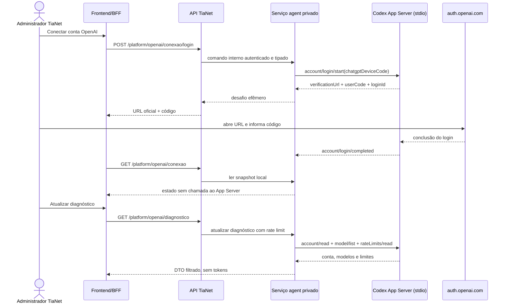

# Arquitetura proposta — piloto de autenticação OpenAI/Codex

**Identificador local:** `openai-codex-auth-pilot-2026-09-09`

**Data:** 2026-09-09

**Versão:** 1.3.0

**Status:** Aprovado pelo proprietário em 2026-09-09; execução local autorizada pelo plano, sem autenticação real ainda.

**Workflow / classificação:** `architect` / `ARCHITECTURAL`

**Impacto agentic:** `PRESENT` — autenticação de provedor de IA, credencial de conta, catálogo de modelos e limites de consumo.

## 1. Decisão solicitada e limite desta etapa

O proprietário decidiu priorizar a autenticação OpenAI e manter OpenRouter,
NVIDIA e OmniRoute em espera para observar o comportamento real antes de escolher
a rota de inferência do produto.

Esta arquitetura entrega primeiro **conexão administrativa e diagnóstico** pelo
[Codex App Server oficial](https://learn.chatgpt.com/docs/app-server). A etapa
permite iniciar o login por device code, observar conclusão, consultar tipo de
plano, catálogo de modelos e janelas de uso, e desconectar localmente. Ela não
inicia conversa, turno, tool, shell, leitura de arquivo ou chamada de modelo.

O repositório comunitário `openai-oauth` continua apenas como referência e não é
dependência. A direção OpenRouter/NVIDIA/OmniRoute já aprovada não é apagada:
fica suspensa para execução, sem fallback automático, até a prova OpenAI produzir
evidência e o proprietário decidir a rota de inferência.

## 2. Fatos observados e desconhecidos

- O host atual possui `codex-cli 0.146.1`; `codex app-server --help` confirma
  `stdio` como transporte padrão e marca a superfície como experimental.
- O schema estável gerado localmente, sem `--experimental`, contém
  `account/login/start` com `chatgptDeviceCode`, `account/login/cancel`,
  `account/read`, `model/list`, `account/rateLimits/read`, `account/logout` e a notificação
  `account/login/completed`.
- O device code devolve `verificationUrl`, `userCode` e `loginId`. Tokens ficam
  sob ownership do App Server e não precisam passar pelo navegador ou banco da
  TiaNet.
- `account/read` pode devolver `planType=free`; `account/rateLimits/read` expõe
  percentuais e reset das janelas disponíveis. A documentação pública não fixa
  uma quantidade numérica universal para o plano Free.
- O App Server contém capacidades mais amplas que autenticação. Nesta etapa elas
  não são chamadas. A impossibilidade mecânica de executar threads/tools será
  exigida antes de qualquer inferência.
- `account/logout` comprova desligamento local. Revogação remota de uma sessão já
  emitida não foi demonstrada e não pode ser anunciada pela interface.

## 3. Alternativas

| Alternativa | Simplicidade | Isolamento | Evolução | Decisão |
|---|---|---|---|---|
| App Server como filho da API TiaNet | Alta no primeiro patch | Fraco: credencial e processo ficam junto da API financeira | Exige mover depois para o processo agent | Rejeitada |
| App Server como filho do frontend Next.js | Média | Fraco e incompatível com múltiplos workers/restarts | Acopla segredo e estado ao BFF | Rejeitada |
| Serviço `agent` mínimo, privado, dono do App Server | Média | Forte: usuário, volume, rede e processo próprios | É o esqueleto da topologia já prevista no IMP-356 | Recomendada |
| API OpenAI por chave de projeto | Alta e contratualmente clara | Bom com secret store | Não atende o pedido de login pela conta ChatGPT/Codex | Mantida como alternativa futura |

## 4. Fronteiras e fluxo alvo

O frontend nunca fala com o serviço `agent` nem com o App Server. A API pública
TiaNet aplica sua autenticação, RBAC e escopo de Tenant. A API chama o serviço
por HTTP sobre socket Unix em um volume runtime que contém somente esse socket;
o `agent` mantém sua rede de egress exclusiva e não ganha rota TCP para API ou
PostgreSQL. O canal exige um segredo de serviço diferente da sessão humana e da
sessão Codex. A API não recebe nem persiste access token, refresh token ou ID
token.

O processo `agent` inicia exatamente um App Server por Tenant operacional. O v1
continua single-tenant conforme a ADR-003. Um segundo Tenant exige processo e
diretório de credenciais próprios ou nova decisão de cofre; não se multiplexa a
mesma conta.

## 5. Contrato e estados

### 5.1 API pública administrativa

| Operação | Permissão | Resultado |
|---|---|---|
| `GET /platform/openai/conexao` | `openai.conexao.ler` | Snapshot local do estado; nunca chama App Server ou rede |
| `GET /platform/openai/diagnostico` | `openai.conexao.ler` | Atualização explícita/cacheada de plano, modelos e limites |
| `POST /platform/openai/conexao/login` | `openai.conexao.gerir` | URL oficial, código efêmero e expiração conhecida quando disponível |
| `DELETE /platform/openai/conexao` | `openai.conexao.gerir` | Logout local com `Idempotency-Key`; declara que revogação remota não foi comprovada |

O `POST` não usa o replay genérico da TiaNet: persistir a resposta preservaria o
device code, que é material efêmero de autenticação. Repetição enquanto há um
login ativo devolve o mesmo desafio apenas da memória do processo; expirado o
desafio, cria outro. O `DELETE` converge quando já desconectado. Como a SPEC-004
exige `Idempotency-Key` para escritas e a ADR-019 limita a exceção ao WhatsApp,
essa exceção, restrita ao `POST` de login, precisa ser formalizada em ADR antes
do código de rotas. O `DELETE` usa o replay normal porque sua resposta não
contém material de autenticação.

O diagnóstico executa no máximo uma atualização por Tenant a cada 60 segundos;
chamadas concorrentes compartilham o mesmo resultado. Dentro da janela, o GET
devolve o snapshot anterior com `observado_em`. Falha parcial identifica
separadamente conta, catálogo e limites. O polling da tela usa somente o GET de
conexão, a cada 3 segundos por no máximo 10 minutos; um teste conta zero chamadas
ao App Server durante consultas repetidas desse endpoint.

### 5.2 Máquina de estados

`INDISPONIVEL` significa binário/processo ausente ou incompatível;
`DESCONECTADO`, conta ausente; `AGUARDANDO_USUARIO`, desafio vigente;
`CONECTADO`, `account/read` confirmou conta; `LIMITE_ATINGIDO`, conta válida e
alguma janela aplicável esgotada; `ERRO`, falha transitória sem afirmar
desconexão.

O estado observado no App Server prevalece sobre cache. E-mail da conta é PII e
não é necessário para operar: a resposta pública mostra apenas tipo de conta e
plano. `loginId`, `userCode` e `verificationUrl` existem apenas na resposta da
ação e na memória volátil do serviço. Logs, métricas e auditoria registram
operação, ator, Tenant, estado final, versão do CLI e correlation ID, sem esses
valores.

Todas as mutações são serializadas por Tenant. Cada tentativa recebe uma geração
monotônica em memória e um `loginId`; apenas a combinação ativa pode alterar o
estado. Novo login enquanto há desafio vigente devolve o mesmo desafio. Após 10
minutos, o serviço executa `account/login/cancel`; expiração não informada pelo
protocolo nunca é inventada na resposta.

O diagnóstico captura a geração da sessão ao iniciar e só publica seu snapshot
se a mesma geração continuar ativa ao terminar. Logout invalida diagnósticos em
andamento; uma resposta antiga nunca restaura `CONECTADO` nem metadados da conta
anterior.

Logout durante `AGUARDANDO_USUARIO` cancela o `loginId`, encerra e recria o
processo filho, executa `account/logout` e confirma `account/read` com
`refreshToken=false` antes de anunciar `DESCONECTADO`. Notificação de geração
antiga é ignorada. Timeout de `login/start`, cancelamento, logout ou confirmação
produz `ERRO_RESULTADO_DESCONHECIDO`, reinicia o filho e reconcilia por
`account/read`; não inicia outro login até obter estado conclusivo. No restart do
serviço, nenhum desafio é restaurado e a mesma reconciliação determina se já há
conta local.

## 6. Isolamento e segurança

O serviço `agent` roda com usuário sem privilégios, filesystem somente leitura
exceto volume dedicado de credenciais e diretório temporário vazio. Ele não
monta código-fonte, `.git`, documentos, banco, volume da API nem o `CODEX_HOME`
do ambiente de engenharia. O `CODEX_HOME` do processo aponta para o volume
dedicado. A API e o frontend não montam esse volume.

Um segundo volume mínimo, montado apenas em API e `agent`, contém o socket Unix.
O diretório usa modo `0750` e grupo dedicado; o socket usa `0660`. A API pode
conectar, mas não deve criar, substituir ou remover entradas do diretório. O
listener recusa symlinks e só remove socket residual depois de comprovar que não
há instância ativa. Somente uma instância possui o caminho. Não há listener nem
fallback TCP.

O adapter JSON-RPC mantém allowlist fechada dos métodos desta etapa:
inicialização do protocolo, `account/login/start`, `account/login/cancel`,
`account/read`, `model/list`, `account/rateLimits/read` e `account/logout`;
notificações aceitas também são
fechadas. Mensagem desconhecida, resposta acima do limite, JSON inválido,
processo encerrado, timeout ou versão incompatível falham fechados. Nenhum
`thread/start`, `turn/start`, `command`, MCP ou `dynamicTools` entra no binário
da aplicação nesta etapa.

Limites iniciais: frame JSON-RPC de 1 MiB; inicialização e cada operação de conta
em até 15 segundos; mutação completa, incluindo espera pela exclusão, em até 8
segundos, seguida por no máximo 4 segundos de reconciliação ainda sob a mesma
exclusão; diagnóstico e sua admissão em até 12 segundos; uma mutação e uma
atualização de diagnóstico concorrentes por Tenant; no máximo 10 minutos de
desafio local; 60 segundos entre diagnósticos; reinício único do filho para
reconciliar resultado incerto, sem loop. Exceder um limite falha fechado. Esses
valores são parâmetros testados e só mudam por revisão do plano.

O transporte interno também limita corpo, conexões concorrentes, backlog e
timeout. O healthcheck usa o mesmo socket da API e combina disponibilidade do
transporte com saúde local do App Server; a mera existência do arquivo não
declara prontidão.

O processo acessa somente os hosts OpenAI necessários à autenticação e às
consultas de conta por um proxy CONNECT dedicado. A rede do `agent` é interna;
o proxy, sem volumes ou credenciais, participa também de uma rede de saída,
aceita apenas porta 443 e uma allowlist explícita, recusa IP privado após DNS e
limita a 16 túneis, com deadlines de DNS, conexão, escrita, ociosidade e
fechamento, além de limites de cabeçalho e bytes. Segredos de comunicação
interna e o volume de credenciais ficam fora de Git, logs, backups genéricos e
respostas de erro.

Antes do login real, um teste dentro do container deve falhar ao alcançar API
TiaNet, PostgreSQL, volumes da aplicação, checkout, `.git` e `CODEX_HOME` de
engenharia. Também deve demonstrar usuário não root, mounts esperados e ausência
de porta publicada. Falhar em qualquer item bloqueia a prova com a conta.

## 7. Persistência, operação e compatibilidade

Não há migration de domínio nesta etapa. O estado autoritativo de autenticação é
o volume do App Server; estado público é consultado ao vivo. A auditoria
append-only da ação guarda somente metadados não sensíveis. Se a trilha existente
não puder registrar a operação sem persistir o desafio, a implementação para e
reabre o desenho antes da rota.

O container do `agent` fixa uma versão explícita do Codex CLI e verifica o
schema/protocolo no build. Atualização de versão não é automática: gera diff do
schema estável, executa testes de contrato e exige nova imagem. O serviço começa
desabilitado por `OPENAI_CODEX_AUTH_ENABLED=false` e recusa iniciar login quando
o binário ou volume seguro não estiverem prontos.

Antes do código, PLAN-033, backlog, DR-005 e HANDOFF registram que este trabalho
é uma preparação administrativa local anterior ao IMP-356. Ele não conta como
execução do IMP-356, não recebe webhook público, não elimina as dependências do
IMP-359 e não fecha GATE-E1b/E3. Os quatro endpoints entram no contrato público
do PLAN-033 durante essa reconciliação, evitando dois planos executáveis
contraditórios.

OpenRouter, NVIDIA e OmniRoute não recebem credencial, tráfego ou fallback. As
variáveis `LLM_*` existentes permanecem vazias/inativas durante o piloto.

## 8. Avaliação prática em duas portas

**Porta de autenticação:** após testes com fake, o proprietário executa o login
oficial no navegador. A prova aceita somente dados da própria conta: conexão,
plano, modelos e limites. Sucesso exige reconexão após restart, logout local,
ausência de token/código nos logs e nenhum método fora da allowlist.

**Porta de inferência posterior:** uma única solicitação sintética, sem dado da
TiaNet ou de cliente, poderá medir variação de `usedPercent` antes/depois e
confirmar um modelo visível. Isso exige extensão aprovada do plano porque abre
`thread/start`/`turn/start` e a superfície de execução do Codex. Tools e dados
reais continuam bloqueados.

O resultado deve registrar plano observado, modelos retornados, janelas e
percentuais antes/depois, versão do CLI, duração e erros. Ausência de variação
mensurável é resultado inconclusivo, não uso zero. A capacidade para 10–20
clientes só será estimada depois de várias amostras sintéticas comparáveis.

## 9. Rollout, rollback e condições de redesign

Rollout: fake local → contrato API/BFF → container isolado deslogado → login real
assistido → restart/logout → decisão sobre prova de inferência. A flag permanece
desligada fora da sessão de prova.

Rollback: desligar a flag, parar o serviço e revogar o segredo interno. Remover o
volume de credenciais é ação destrutiva separada e explícita; logout local ocorre
antes quando o processo responde. A interface não promete revogação remota.

Exigem redesign: transporte remoto/WebSocket, mais de um Tenant por processo,
login por usuário final, armazenamento de tokens pela TiaNet, execução de shell
ou filesystem, uso de `dynamicTools`, dados reais sob política pessoal sem aceite
da DR-005, ou uso produtivo de conta pessoal sem confirmação contratual adequada.

## 10. Decisão arquitetural a formalizar

Esta arquitetura emite a [ADR-020](../adrs/ADR-020-autenticacao-openai-codex-app-server.md), próxima ADR livre governada pelo AMP-001,
para registrar: serviço `agent` privado como dono do Codex App Server; login
ChatGPT por device code; credenciais fora da API e do banco; allowlist apenas de
conta no primeiro incremento; exceção de idempotência limitada ao desafio
efêmero; inferência e tools sob decisão posterior.

Essa decisão especializa o IMP-356 sem substituir a arquitetura do assistente.
A aceitação da autenticação não seleciona ainda o provedor de inferência e não
fecha GATE-E1b ou GATE-E3.

## 11. Referências

- [Discovery OpenAI OAuth/Codex](../../audits/discoveries/openai-oauth-chatgpt-codex-2026-09-09.md)
- [Codex App Server](https://learn.chatgpt.com/docs/app-server)
- [Autenticação Codex](https://learn.chatgpt.com/docs/auth)
- [Preços e limites Codex](https://learn.chatgpt.com/docs/pricing)
- [PLAN-033](../../implementation/plans/PLAN-033-copilot-tianet.md)
- [Backlog PLAN-033](../../implementation/backlogs/PLAN-033-execution-backlog.md)
- [SPEC-004](../../governance/agents/SPEC-004-regras-normativas-do-codigo.md)

## Histórico de versões

| Versão | Data | Descrição |
|---|---|---|
| 1.3.0 | 2026-09-09 | Fecha o egress do agent por proxy CONNECT com allowlist após a prova local detectar alcance indireto ao host. |
| 1.2.0 | 2026-09-09 | Registra aprovação do proprietário e emissão da ADR-020. |
| 1.1.0 | 2026-09-09 | Separa polling de diagnóstico, formaliza a preparação anterior ao IMP-356, fecha corridas de login/logout e fixa limites iniciais após revisão especializada. |
| 1.0.0 | 2026-09-09 | Propõe o piloto oficial de autenticação OpenAI/Codex isolado, sem inferência, e suspende a execução dos demais provedores. |
