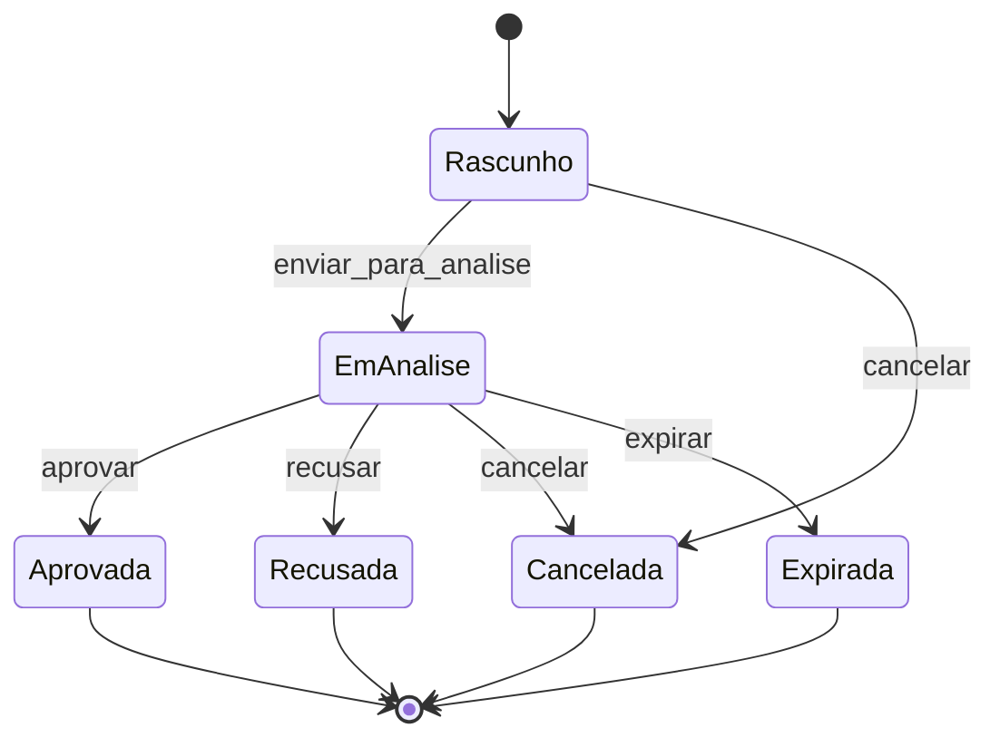

# EPIC-003 - Product Discovery - Comercial / Propostas / Simulacao

**ID:** EPIC-003

**Tipo:** Artefato de Discovery (engenharia de produto)

**Status:** Em revisao

---

# 1. Objetivo de Negocio

Definir o primeiro recorte do contexto **Comercial**: originar simulacoes e
propostas de credito para Devedores ja cadastrados, permitindo que o Credor
avalie cenarios comerciais, registre uma proposta rastreavel e decida se ela
segue para formalizacao no contexto Contratos.

Este Discovery nasce como o proximo ciclo apos IAM/P4 porque o roadmap oficial
fixa a sequencia **Cadastro -> Comercial -> Contratos -> Motor Financeiro**
(`ROADMAP-ALIGNMENT`, `AMP-001` e `FOUNDATION-009`). Portanto, o EPIC-003 nao
deve implementar contrato, emprestimo, parcela, pagamento ou calculo financeiro
definitivo.

# 2. Valor Entregue ao Usuario

- O Credor consegue simular condicoes comerciais antes de assumir uma obrigacao
  formal;
- A proposta cria uma trilha de decisao entre Cadastro e Contratos;
- A aprovacao comercial vira entrada controlada para o contexto Contratos;
- Propostas recusadas, expiradas ou canceladas permanecem auditaveis;
- A plataforma evita que o Motor Financeiro seja chamado antes de existir uma
  proposta comercial validada e formalizavel.

# 3. Fontes de Autoridade

| Fonte | Decisao aplicada neste Discovery |
|---|---|
| `ROADMAP-ALIGNMENT` | Sequencia global: EPIC-003 = Comercial, Epico 004 = Contratos, Epico 005 = Emprestimos/Pagamentos/Motor Financeiro. |
| `AMP-001` | Comercial e downstream de Cadastro e upstream de Contratos; Motor Financeiro e a unica autoridade de calculo. |
| `FOUNDATION-009` | Discovery precede Product/EPIC/Feature/User Story; PRODUCT-N nasce somente quando houver necessidade real. |
| `PLAN-008` | O ciclo pos-IAM/P4 deve iniciar pela Discovery/SDD do Epico 003 Comercial, nao por codigo. |
| `EPIC-002 Discovery` | Devedor ativo, Carteira e isolamento por Tenant sao pre-condicoes para originacao. |
| `ADR-004` | Endpoints novos devem nascer protegidos por autenticacao e autorizacao RBAC. |

# 4. Escopo

- Criar simulacao comercial associada a Carteira, Tenant e Devedor;
- Registrar parametros comerciais informados pelo Credor;
- Criar proposta a partir de uma simulacao ou entrada equivalente;
- Consultar proposta por ID;
- Listar propostas por Carteira, Devedor, estado e periodo;
- Aprovar proposta para permitir formalizacao futura;
- Recusar, cancelar ou expirar proposta;
- Auditar escritas e transicoes de estado;
- Expor contratos de integracao para Cadastro, IAM e Contratos futuro;
- Definir suites iniciais antes de qualquer implementacao.

# 5. Fora do Escopo

- Formalizar Contrato de Credito;
- Gerar assinatura, liberacao ou documento contratual;
- Criar Emprestimo, Parcela ou Pagamento;
- Executar juros, amortizacao, saldo, quitacao ou memoria de calculo;
- Persistir snapshots financeiros definitivos;
- Integrar bureaus de credito, open finance, bancos, PIX ou provedores externos;
- Fazer analise automatizada de credito ou scoring por IA;
- Criar Product/Feature/User Story final antes da aprovacao desta Discovery.

# 6. Linguagem Ubiqua

| Termo | Definicao neste contexto |
|---|---|
| Comercial | Contexto responsavel por simulacao, proposta, analise e aprovacao comercial. |
| Simulacao | Registro nao vinculante de parametros comerciais usados para avaliar um cenario de credito. |
| Proposta | Intencao comercial rastreavel de conceder credito a um Devedor sob parametros definidos. |
| Parametros Comerciais | Valor solicitado, modalidade, prazo desejado, data de validade e observacoes comerciais. |
| Parecer Comercial | Decisao humana ou sistemica sobre seguir, recusar, cancelar ou expirar uma proposta. |
| Proposta Aprovada | Proposta apta a ser consumida por Contratos, sem ainda criar obrigacao financeira. |
| Proposta Recusada | Proposta encerrada por decisao comercial negativa. |
| Proposta Cancelada | Proposta encerrada antes da aprovacao por acao do Credor. |
| Proposta Expirada | Proposta encerrada por perda de validade temporal. |

# 7. Atores

| Ator | Papel |
|---|---|
| Credor / Operador Comercial | Simula, cria, consulta, aprova, recusa ou cancela propostas da propria Carteira. |
| Administrador do Tenant | Pode administrar permissoes comerciais e auditar operacoes. |
| Sistema | Expira propostas vencidas e aplica bloqueios de estado. |
| Contratos futuro | Consumira propostas aprovadas como entrada de formalizacao. |

# 8. Casos de Uso Candidatos

Os identificadores abaixo sao candidatos locais deste Discovery. Os IDs
definitivos devem ser emitidos na Fase Product/SDD conforme o Registry.

| ID | Caso de uso |
|---|---|
| UC-030 | Criar simulacao comercial para Devedor ativo. |
| UC-031 | Consultar simulacao comercial. |
| UC-032 | Criar proposta comercial. |
| UC-033 | Consultar proposta por ID. |
| UC-034 | Listar propostas por Carteira, Devedor, estado e periodo. |
| UC-035 | Aprovar proposta. |
| UC-036 | Recusar proposta. |
| UC-037 | Cancelar proposta. |
| UC-038 | Expirar propostas vencidas. |
| UC-039 | Consultar trilha de decisoes comerciais. |

# 9. Regras de Negocio

- RB-001: Toda simulacao ou proposta pertence exatamente a uma Carteira e,
  transitivamente, a um Tenant;
- RB-002: Toda proposta deve referenciar um Devedor existente da mesma Carteira;
- RB-003: Devedor inativo nao pode originar nova simulacao ou proposta;
- RB-004: Proposta nasce em estado Rascunho ou Em Analise, conforme o fluxo de
  entrada escolhido na Fase Product;
- RB-005: Apenas proposta em estado elegivel pode ser aprovada;
- RB-006: Proposta aprovada nao pode ser editada em seus parametros comerciais;
- RB-007: Proposta recusada, cancelada ou expirada nao pode ser aprovada sem
  criar uma nova proposta;
- RB-008: Toda transicao de estado gera auditoria append-only;
- RB-009: Comercial pode registrar parametros e resultados estimados, mas nao
  executa calculo financeiro definitivo;
- RB-010: Recurso de outro Tenant deve ser tratado como inexistente na API;
- RB-011: Proposta aprovada e a unica saida permitida para o contexto Contratos;
- RB-012: Simulacao nao cria obrigacao financeira nem reserva limite.

# 10. Maquina de Estados

Estado candidato da **Proposta Comercial**:



Estados terminais: Aprovada, Recusada, Cancelada e Expirada.

# 11. Invariantes

- INV-001: Proposta nunca existe fora de uma Carteira;
- INV-002: Proposta nunca referencia Devedor de outra Carteira/Tenant;
- INV-003: Proposta terminal nao retorna a estado operacional;
- INV-004: Parametros comerciais aprovados sao imutaveis;
- INV-005: Toda decisao comercial possui ator, instante, estado anterior e
  estado posterior;
- INV-006: Nenhum calculo financeiro definitivo pertence ao Comercial.

# 12. Eventos de Dominio Candidatos

| Evento | Ocorre quando | Consumidores previstos |
|---|---|---|
| Simulacao Comercial Criada | Um cenario comercial e registrado | Auditoria, Relatorios futuros |
| Proposta Comercial Criada | Uma proposta e aberta | Auditoria, Search futuro |
| Proposta Comercial Aprovada | Proposta fica apta a formalizacao | Contratos futuro |
| Proposta Comercial Recusada | Decisao comercial negativa e registrada | Relatorios futuros |
| Proposta Comercial Cancelada | Credor encerra proposta antes da aprovacao | Relatorios futuros |
| Proposta Comercial Expirada | Validade temporal e atingida | Relatorios futuros |

# 13. Contratos de Integracao

## 13.1 Entrada de Cadastro

Comercial consome Cadastro por referencia, sem copiar o modelo interno:

| Dado | Origem | Uso |
|---|---|---|
| `tenant_id` | Principal autenticado / Carteira | Isolamento e autorizacao. |
| `carteira_id` | Cadastro/Credit | Escopo operacional da proposta. |
| `devedor_id` | Cadastro | Tomador da proposta. |
| Estado do Devedor | Cadastro | Bloquear origem quando inativo. |
| Documento/Nome de exibicao | Cadastro | Exibicao e auditoria, sem redefinir Pessoa. |

## 13.2 Saida para Contratos

Contratos futuro deve consumir somente uma proposta aprovada:

| Campo logico | Observacao |
|---|---|
| `proposta_id` | Identidade da proposta aprovada. |
| `tenant_id` / `carteira_id` | Fronteira multi-tenant. |
| `devedor_id` | Tomador que sera formalizado no contrato. |
| Parametros comerciais aprovados | Entrada comercial; nao memoria de calculo definitiva. |
| Instante de aprovacao | Marco de rastreabilidade para formalizacao. |

## 13.3 IAM e RBAC

Permissoes candidatas para a Fase Product:

| Permissao candidata | Operacoes cobertas |
|---|---|
| `comercial:simulacao:criar` | Criar simulacao. |
| `comercial:proposta:criar` | Criar proposta. |
| `comercial:proposta:ler` | Consultar e listar propostas. |
| `comercial:proposta:decidir` | Aprovar, recusar, cancelar e expirar proposta. |
| `comercial:auditoria:ler` | Consultar trilha de decisoes comerciais. |

# 14. API Candidata

A API definitiva deve nascer no plano de implementacao. Contrato candidato:

| Metodo | Rota candidata | Resultado |
|---|---|---|
| `POST` | `/carteiras/{carteira_id}/devedores/{devedor_id}/simulacoes` | Criar simulacao. |
| `GET` | `/carteiras/{carteira_id}/simulacoes/{simulacao_id}` | Consultar simulacao. |
| `POST` | `/carteiras/{carteira_id}/devedores/{devedor_id}/propostas` | Criar proposta. |
| `GET` | `/carteiras/{carteira_id}/propostas/{proposta_id}` | Consultar proposta. |
| `GET` | `/carteiras/{carteira_id}/propostas` | Listar propostas. |
| `POST` | `/carteiras/{carteira_id}/propostas/{proposta_id}/aprovar` | Aprovar proposta. |
| `POST` | `/carteiras/{carteira_id}/propostas/{proposta_id}/recusar` | Recusar proposta. |
| `POST` | `/carteiras/{carteira_id}/propostas/{proposta_id}/cancelar` | Cancelar proposta. |
| `POST` | `/carteiras/{carteira_id}/propostas/{proposta_id}/expirar` | Expirar proposta. |

Respostas obrigatorias candidatas: `401` sem autenticacao, `403` sem permissao,
`404` recurso inexistente ou de outro Tenant, `409` conflito de estado, `422`
entrada invalida.

# 15. Plano Inicial de Testes

| Suite | Objetivo |
|---|---|
| Unit domain Comercial | Estados, invariantes e transicoes de Simulacao/Proposta sem banco. |
| Unit application Comercial | Orquestracao de criacao, consulta e decisao com portas fake. |
| Integration repositories | Persistencia de simulacoes, propostas, decisoes e filtros por Tenant/Carteira. |
| Integration migrations | Ciclo upgrade/downgrade/upgrade das tabelas comerciais. |
| Integration API | Contratos HTTP, RBAC, OpenAPI e erros `401/403/404/409/422`. |
| Regression IAM | Garantir que endpoints comerciais exigem Principal e permissoes corretas. |
| Regression Cadastro | Bloquear Devedor inexistente, inativo ou de outra Carteira. |
| Guardrail Motor | Testes que impedem calculo financeiro definitivo no Comercial. |

# 16. Riscos

| ID | Risco | Mitigacao |
|---|---|---|
| R-01 | Comercial virar Motor Financeiro disfarçado | Separar parametros comerciais de memoria de calculo; suite Guardrail Motor. |
| R-02 | Pular Contratos e criar Emprestimo a partir da proposta | Saida do EPIC-003 e apenas proposta aprovada para Contratos futuro. |
| R-03 | Copiar dados cadastrais e gerar divergencia | Referenciar Devedor/Carteira; snapshots apenas se aprovados em Product/ADR. |
| R-04 | API nascer sem IAM | Incluir RBAC e testes de 401/403 desde o primeiro plano. |
| R-05 | Proposta aprovada ser editavel | Imutabilidade de parametros aprovados como invariante. |
| R-06 | Vazar existencia cross-tenant | 404 para recurso de outro Tenant, seguindo precedente do IAM. |
| R-07 | Criar PRODUCT antes de resolver capacidade | Discovery registra criterio; Product nasce na Fase SDD. |

# 17. Dependencias

- EPIC-001 - Gerenciar Tenant: fornece Tenant e Carteira;
- EPIC-002 - Cadastro de Devedores: fornece Devedor ativo;
- EPIC-006 - IAM: autentica Principal e autoriza operacoes;
- ADR-001 - Stack e camadas;
- ADR-002 - Auditoria append-only;
- ADR-004 - Autenticacao e autorizacao;
- FOUNDATION-006 - isolamento multi-tenant;
- FOUNDATION-009 - Capability Map e ciclo de vida;
- PLAN-008 - plano tecnico do ciclo pos-IAM/P4.

# 18. Decisao sobre Capability/Product

O contexto Comercial atende aos criterios de nova Capability de `FOUNDATION-009`
porque possui linguagem propria, ciclo de vida proprio e roadmap distinto de
Cadastro, Contratos e Motor Financeiro.

Decisao candidata para a Fase SDD: criar a Capability **Administrar Comercial**
como proximo PRODUCT-N, vinculando:

```
Administrar Comercial -> Comercial -> EPIC-003 -> Features -> User Stories
```

Este Discovery nao cria o documento Product definitivo. Ele registra a
necessidade e prepara a materializacao conforme a regra de criacao tardia.

# 19. Fronteiras do Bounded Context

| Contexto | Relacao com Comercial | Regra |
|---|---|---|
| Cadastro | Upstream | Comercial consome Devedor ativo por referencia. |
| IAM | Transversal | Toda operacao comercial exige Principal e permissao. |
| Contratos | Downstream futuro | Consome apenas proposta aprovada. |
| Motor Financeiro | Fora do escopo | Nao recebe chamada direta neste EPIC e nao tem regra duplicada aqui. |
| Configuracoes Financeiras | Dependencia futura | Pode fornecer parametros permitidos, sem entrar no escopo do EPIC-003. |
| Relatorios/Search | Consumidores futuros | Consomem eventos, sem comandar transicoes. |

# 20. Autoavaliacao de Consistencia

| Verificacao | Resultado |
|---|---|
| Conflito com fontes oficiais | Nenhum: Comercial e o EPIC-003 no roadmap corrigido. |
| Necessidade de alterar FOUNDATION | Nao neste momento; a criacao de Product/Capability deve ocorrer na Fase SDD se aprovada. |
| Necessidade de ADR nova | Nao identificada para Discovery; ADR futura pode surgir se houver snapshots comerciais ou regras de expiracao assincrona. |
| Mudanca de Bounded Context | Nao; Comercial ja consta como emergente em AMP-001 e FOUNDATION-009. |
| Conflito de linguagem ubiqua | Nao; termos novos ficam confinados ao contexto Comercial. |
| Duvida sobre Core Domain | Nao; Motor Financeiro permanece o unico Core Domain. |
| Decisoes irreversiveis | Nenhuma; documento de Discovery apenas. |
| Ordem SDD | Preservada: Discovery antes de Product, Plan, Backlog e implementacao. |

Conclusao: o Discovery esta pronto para revisao arquitetural/produto e deve
seguir para a Fase SDD somente apos aprovacao.

---

# Features e User Stories Candidatas

Materializar somente na Fase Product/SDD:

- Feature candidata - Simular Credito: criar e consultar simulacoes;
- Feature candidata - Criar Proposta Comercial: criar proposta vinculada a
  Devedor ativo;
- Feature candidata - Consultar Propostas: consultar por ID, listar por filtros
  e consultar trilha de decisao;
- Feature candidata - Decidir Proposta: aprovar, recusar, cancelar e expirar;
- Feature candidata - Integrar Proposta Aprovada: disponibilizar contrato logico
  para o contexto Contratos.

Critérios de aceitacao transversais candidatos:

- operacoes comerciais protegidas por IAM/RBAC;
- isolamento por Tenant/Carteira em todas as consultas e escritas;
- proposta de outro Tenant responde `404`;
- transicao invalida responde `409`;
- entrada invalida responde `422`;
- toda escrita gera auditoria append-only;
- nenhuma suite aceita calculo financeiro definitivo no Comercial.

---

# Historico de Versoes

| Versao | Data | Descricao |
|---|---|---|
| 0.1.0 | 2026-08-09 | Primeira versao do Discovery do EPIC-003 Comercial / Propostas / Simulacao, criada como proximo ciclo pos-IAM/P4. |
