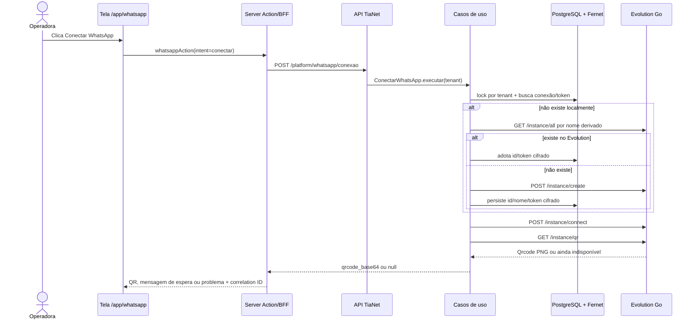

# Raio X AS-IS/TO-BE — conector WhatsApp

**Data:** 2026-09-09  
**Workflow:** Discover  
**Classificação:** SUBSTANTIAL  
**Impacto agentic:** NONE  
**Estado:** leitura e geração de QR corrigidas e verificadas até a aplicação; observação visual e pareamento pendentes

## 1. Problema e objetivo

A tela passou a exibir o acesso ao WhatsApp, mas o clique em **Conectar
WhatsApp** retornou `Serviço temporariamente indisponível` com correlation ID.
O objetivo deste raio X é separar:

1. o que já existe e está coberto por código e testes;
2. o que as respostas técnicas de 2026-09-04 mudaram no contrato;
3. quais divergências ainda existem entre documentação, código e operação;
4. o que falta observar antes de afirmar que o conector está pronto para uso.

Este documento não autoriza nem executa conexão, pareamento, envio, exclusão de
instância ou chamada ao ambiente real do Evolution.

## 2. Conclusão executiva

O conector está implementado da tela até o adapter do Evolution. A implementação
atual já incorporou os principais esclarecimentos de 2026-09-04: distinção entre
`Connected` e `LoggedIn`, rotação do QR a cada 20 segundos, repetição segura do
`connect`, tratamento de qualquer HTTP 400 do logout repetido como estado já
convergido e proibição de retry automático quando o resultado de um envio é
incerto.

Isso não provava que o recurso estivesse operacional. Após a correção de
configuração, uma nova observação entre 13:05:41Z e 13:07:25Z mostrou quatro
respostas `500` de `GET /platform/whatsapp/conexao`. O caminho diagnóstico
confirmou uma conexão persistida, token decifrado corretamente e a resposta real
`400: client disconnected` de `GET /instance/status`. O adapter classificava
essa sessão desconectada como `EvolutionIndisponivelError`, e o handler genérico
a transformava em 500.

O adapter foi corrigido para converter somente `client disconnected` e `no
active session found` em estado `conectado=false, pareado=false`; qualquer outro
HTTP 400 continua falhando fechado. Depois da reconstrução de API e worker, a
mesma leitura real retornou estado desconectado sem exceção. Na jornada
autenticada, cinco `POST /platform/whatsapp/conexao` concluíram com 200 e
auditoria de sucesso, mas nenhum QR apareceu. A equipe do Evolution confirmou
nos logs do servidor que o handshake ainda usa a versão hardcoded antiga, recebe
`405 client-outdated` e deixa um ponteiro de client desconectado no mapa; novos
`connect` apenas atualizam configurações e não reiniciam o client.

Depois do patch e rebuild do Evolution, a mesma instância antes zumbi recuperou
sem delete/recreate. O primeiro ciclo controlado devolveu QR PNG válido e estado
`Connected=true, LoggedIn=false`. O caso de uso da TiaNet repetiu o resultado e
registrou `conectar.inicio` e `conectar.sucesso`.

Portanto, o estado correto é **defeitos da TiaNet e do Evolution corrigidos e
verificados até a camada de aplicação; observação visual e pareamento ainda
pendentes**. Ainda não é correto declarar o WhatsApp pronto para uso completo.

## 3. Contexto e fontes

Fontes normativas e técnicas consultadas:

- [DR-006](../../governance/decision-requests/DR-006-conexao-do-whatsapp-dentro-da-plataforma.md);
- [PLAN-034](../../implementation/plans/PLAN-034-conexao-do-whatsapp-na-plataforma.md)
  e seu [backlog](../../implementation/backlogs/PLAN-034-execution-backlog.md);
- [ADR-019](../../architecture/adrs/ADR-019-isencao-de-idempotency-key-nas-escritas-da-conexao-de-whatsapp.md);
- [contrato CRM/Evolution](../../whatsapp/CRM_EVOLUTION_CONTRACT.md);
- [perguntas enviadas em 04/09](../../whatsapp/2026-09-04-solicitacao-esclarecimento-evolution.md)
  e [respostas recebidas](../../whatsapp/2026-09-04-resposta-esclarecimento-evolution.md);
- [contexto externo](../../operations/contexto-externo.md);
- código atual, testes de backend e jornadas do frontend;
- logs e configuração estrutural dos containers locais, sem registrar valores
  secretos.

O arquivo `docs/whatsapp/revisao-manual-colunas-2026-09-09.csv` foi excluído da
análise: seu conteúdo trata da revisão cadastral de colunas e não do conector.

## 4. AS-IS

### 4.1 Fluxo da tela ao provedor

### 4.2 Camadas e responsabilidades

| Camada | Implementação atual | Evidência principal |
|---|---|---|
| UI | Mostra estados inexistente, aguardando QR, conectada e erro. Debounce local pelo estado `pendente`. | `frontend/src/components/whatsapp/whatsapp.client.tsx` |
| Renovação | Repete a ação de conectar a cada 20 s, quatro vezes após a tentativa inicial. O QR visível expira em 30 s. | constantes e efeitos em `whatsapp.client.tsx` |
| Polling | Atualiza o estado a cada 5 s enquanto há QR vigente e nenhuma escrita em curso. | `usePollingDePareamento` |
| BFF | Verifica permissões, encaminha correlation ID e valida a forma da resposta. | `frontend/src/lib/bff/whatsapp.server.ts` |
| API | Expõe consultar, conectar, desconectar e excluir instância. | `src/emprestimo/presentation/api/whatsapp_routes.py` |
| Aplicação | Serializa por Tenant durante a transação, adota/cria instância, audita efeitos e distingue rollback de divergência. | `src/emprestimo/application/conexao_whatsapp.py` |
| Persistência | Uma conexão por Tenant; token de instância cifrado com Fernet; estado vivo não é tratado como fonte local. | repositório, UoW e `cifra.py` |
| Evolution | Separa credencial de Tenant das operações autenticadas pelo token da instância. | `evolution_instancia.py` |

### 4.3 Fronteiras de autenticação

| Operação Evolution | Credencial correta |
|---|---|
| `/instance/all`, `/instance/create`, `/instance/info/:id`, `/instance/delete/:id` | `apikey` do Tenant + `X-Tenant-ID` |
| `/instance/connect`, `/instance/qr`, `/instance/status`, `/instance/logout`, `/send/*` | token da instância em `apikey`, sem `X-Tenant-ID` |

Na TiaNet, leitura exige `whatsapp.conexao.ler`; conectar, desconectar e excluir
exigem `whatsapp.conexao.gerir`. O perfil local de teste possui ambas.

### 4.4 Modelo de estado

- `Connected=true` significa socket aberto em `/instance/status`.
- `LoggedIn=true` significa número pareado e é a verdade usada pela TiaNet.
- `Connected=true` com `LoggedIn=false` é compatível com pareamento pendente.
- O telefone só é obtido pelo `jid` de `/instance/info/:id`, com credencial de
  Tenant, e só é mostrado quando `LoggedIn=true`.
- O QR nunca é persistido nem auditado.
- `queda_detectada_em` registra a transição de pareado para não pareado observada
  em consulta ou sincronização; falha do provedor não inventa queda.

### 4.5 Tratamento de falhas

| Família | Tratamento interno | Efeito percebido na tela |
|---|---|---|
| RBAC | 403 nomeado | `Ação indisponível para este acesso.` |
| Configuração ausente | falha antes do efeito externo; auditoria de falha + rollback | mensagem técnica sanitizada + correlation ID |
| 401/403 do Evolution | recusa comprovada, traduzida para efeito não aplicado | mensagem sanitizada + correlation ID |
| timeout anterior à conexão | prova de não envio | rollback |
| timeout de leitura, reset, 5xx ou resposta malformada | resultado externo incerto | divergência para conciliação |
| QR ainda sendo gerado | estado normal | sucesso com `qrcode_base64=null` e mensagem de espera |
| logout repetido com qualquer HTTP 400 | estado já convergido | sucesso |

O texto `Serviço temporariamente indisponível` não identifica a causa sozinho.
O diagnóstico depende do correlation ID, do tipo de erro e da sequência de
auditoria `conectar.*`. Hoje o `LogRecord` recebe esses campos, mas o formatador
do Uvicorn não os materializa na saída do Docker; ver R4.

## 5. O que as respostas de 2026-09-04 esclareceram

| Resposta do mantenedor | Situação no código atual | Situação documental |
|---|---|---|
| `GET /instance/qr` acompanha a rotação e pode autocurar um ciclo encerrado. | Compatível; o adapter lê o QR atual. | Contrato principal reconciliado; ver D1. |
| Cada QR dura 20 s; o limite padrão da aplicação é cinco códigos. | Implementado na renovação da tela. | Resposta e backlog atualizados. |
| Ao fim do quinto QR o client é desmontado; um novo `GET /instance/qr` pode iniciar autocura. | Fluxo tolera QR temporariamente ausente. | Contrato principal reconciliado. |
| Repetir `POST /instance/connect` durante pareamento é seguro e não reinicia o ciclo. | Usado pela renovação automática. | Registrado no backlog IMP-371. |
| `QRTimeout` ocorre uma vez por ciclo, não por QR. | Não consumido pela TiaNet porque o webhook pertence ao agente e está vazio hoje. | Compatível com a topologia vigente. |
| Logout repetido responde sempre 400. | Qualquer 400 nessa rota é sucesso; há testes com corpos distintos. | ADR-019 e comentário da rota reconciliados. |
| `/send/text` não deduplica por `id`. | Resultado incerto não recebe retry automático. | Contexto externo atualizado. |
| Há risco de race nos mapas internos do Evolution. | Debounce apenas por aba; duas abas ainda podem concorrer. | Caveat aceito no backlog. |
| `connected` tem semântica diferente entre endpoints. | A TiaNet usa `Connected`/`LoggedIn` de `/status` e `jid` de `/info`. | Registrado e coberto. |

## 6. Divergências e riscos

### P0 — bloqueadores do uso real

**P0-1 — corrigido e confirmado na jornada autenticada.**  
A leitura falhava porque `/instance/status` responde `400 client disconnected`
para a sessão encerrada. O adapter agora converte os dois marcadores conhecidos
em estado desconectado. A leitura real depois do rebuild retornou
`CONNECTED=False, PAIRED=False`; a página autenticada ofereceu o botão e chegou
ao `POST` de conexão sem repetir o 500 anterior.

**P0-2 — corrigido no Evolution e verificado pela TiaNet.**  
O provedor resolvia a versão Web atual, mas não chamava `store.SetWAVersion`; o
handshake usava a versão hardcoded anterior e recebia `405 client-outdated`. O
ponteiro deixado no mapa também fazia tentativas posteriores virarem no-op. A
equipe mantenedora corrigiu os dois ramos de versão e a recuperação de client
zumbi em `Connect()` e `ensureClientConnected`, seguidos de rebuild.
Essa recuperação precisa ser serializada por instância ou distinguir client em
inicialização de client desconectado; testar apenas `IsConnected()` abre uma
janela para remover o ponteiro legítimo antes de o socket terminar de subir.
O rebuild foi concluído e a instância existente recuperou sem exclusão: QR PNG
válido na primeira leitura, `Connected=true/LoggedIn=false` e sucesso no caso de
uso da TiaNet.

**P0-3 — publicação na VPS ainda não tem configuração nem teste operacional.**  
O checklist exige levar as três variáveis ao processo correto, validar conexão e
envio, observar queda/recuperação e registrar aceite. Nada disso foi observado na
VPS.

### P1 — contrato, operação e diagnóstico

**D1 — reconciliado localmente.**  
`CRM_EVOLUTION_CONTRACT.md` agora registra a rotação aproximada de 20 segundos,
o limite padrão de cinco códigos, a desmontagem do client e a autocura provocada
por um novo `GET /instance/qr`.

**D2 — reconciliado localmente.**  
O comentário normativo de `whatsapp_routes.py` agora registra que qualquer HTTP
400 de `/instance/logout` representa estado já desconectado, conforme ADR-019
v1.2.0.

**R1 — a mensagem da interface reúne falhas diferentes.**  
A sanitização protege credenciais e detalhes internos, mas configuração,
autenticação do Evolution, transporte e contrato acabam com texto semelhante.
O correlation ID é obrigatório para suporte. Uma taxonomia segura e mais útil
para a operadora pode ser planejada depois que a causa real do clique for
observada.

**R2 — o provedor é singleton por processo.**  
Alterar credenciais no ambiente sem recriar API e worker mantém o cliente antigo
em memória. O procedimento operacional precisa exigir reinício controlado dos
dois serviços após mudança de segredo.

**R3 — concorrência entre abas permanece aberta e aceita.**  
O estado `pendente` impede concorrência numa aba; não existe lock por instância
abrangendo chamadas externas entre abas ou processos. O advisory lock atual
protege a transação e o nascimento da instância, não toda a conversa com o
Evolution.

**R4 — o contexto estruturado não aparece no log de runtime.**  
`registrar_erro_tecnico` anexa `correlation_id`, rota, método e tipo da exceção
ao registro, o que os testes conseguem inspecionar. O formatador ativo do
Uvicorn exibe apenas `http_unexpected_error` no `docker compose logs`. Uma
mudança de observabilidade deve tornar esses campos visíveis sem registrar
segredos.

### P2 — dívida operacional futura

- Não há ambiente de teste do Evolution; a homologação usa cenário real
  controlado e precisa de autorização explícita.
- A janela entre efeito externo e commit continua sendo caveat documentado; a
  adoção por nome e a auditoria de divergência reduzem o dano, mas não formam uma
  saga completa.
- O webhook do Evolution permanece vazio por decisão da DR-006. Recebimento de
  mensagens depende do agente e não faz parte da tela de conexão.

## 7. TO-BE

O estado desejado para declarar o conector operacional é:

1. API e worker recebem, por mecanismo de segredo fora do Git, as credenciais de
   Tenant e a mesma chave de cifra esperada pelos tokens persistidos.
2. Mudanças nesses segredos recriam os processos que mantêm o cliente Evolution
   em memória.
3. Um clique controlado produz uma sequência observável: `conectar.inicio`,
   adoção ou criação única, QR atual ou espera nomeada, pareamento e consulta com
   `LoggedIn=true`.
4. O QR renova em torno de 20 s, encerra a automação após cinco tentativas totais
   e permite novo ciclo por ação explícita da operadora.
5. Logout repetido converge sem erro; queda e recuperação aparecem na interface.
6. Um envio controlado é entregue uma única vez. Resultado incerto bloqueia
   reenvio automático e abre conciliação.
7. Logs por correlation ID e auditoria permitem distinguir configuração,
   autenticação, transporte e contrato sem revelar segredos.
8. Contrato principal, comentário das rotas, checklist e evidências de operação
   descrevem o mesmo comportamento.

## 8. Critério de verificação imediata

A verificação técnica depois do rebuild concluiu os itens 1 a 5 abaixo. Restam a
observação visual e, se autorizado o uso do número real, o pareamento:

1. concluído por efeito observável: QR criado e socket conectado, sem repetição
   do comportamento associado ao `405`;
2. concluído: instância antes zumbi reiniciou sem delete/recreate;
3. concluído no caso de uso da TiaNet: conectar retornou QR PNG válido;
4. concluído: `/instance/status` informou
   `Connected=true, LoggedIn=false` durante o pareamento;
5. concluído: auditoria registrou `conectar.inicio` e `conectar.sucesso`;
6. pendente na interface: observar o QR e uma renovação; interromper antes de parear, salvo
   autorização específica para usar o número real;
7. pendente se houver pareamento: observar `LoggedIn=true` e o telefone sem
   expor esses dados em log.

Essa etapa pertence ao workflow **Verify**. Se a observação provar defeito de
código, abre-se um **Plan** mínimo. Se provar somente divergência documental,
segue-se correção documental proporcional. A arquitetura só precisa ser reaberta
se o proprietário decidir eliminar o caveat de concorrência por instância ou
mudar a topologia do webhook.

## 9. Fora do escopo

- ativar, parear ou apagar instância real;
- enviar mensagem real;
- publicar na VPS;
- implementar o agente que recebe o webhook;
- implementar Mercado Pago;
- alterar a decisão de webhook vazio da DR-006;
- corrigir código ou documentação durante este discovery.

## 10. Delegação pelo Harness

O OpenCode executou primeiro uma missão `READ_ONLY`, sem acesso a `.env`,
credenciais, rede, Docker ou dados reais. A execução não alterou arquivos nem
violou escopo. Depois do diagnóstico local, executou um slice `SCOPED_WRITE`
limitado ao adapter e aos testes. O coordenador conferiu os dois resultados e
registrou ambas as revisões como `APROVADA` no Harness.

- Task ID: `ac55353c-b862-4029-a5c5-467aaed7ec7b`
- Modelo: `opencode/muse-spark-1.3-contributor-free`
- Resultado do executor: `EM_REVIEW`
- Adjudicação: `APROVADA`

Slice de correção:

- Task ID: `9466761a-3275-4a2e-950d-27a9730f8791`
- Arquivos: adapter Evolution e seus testes unitários
- Resultado: 69 testes do arquivo do adapter; revisão `APROVADA`

Revisão do incidente confirmado pelo provedor:

- Task ID: `74230a26-aa6f-4d8c-8976-918a07db1997`
- Política: `READ_ONLY`; nenhuma alteração e nenhuma violação de escopo
- Conclusão: aplicar versão efetiva e recuperação de client zumbi no mesmo
  rebuild; o coordenador acrescentou a exigência de serialização/estado de
  inicialização para não ampliar a race já documentada; nenhuma adaptação
  adicional na TiaNet
- Revisão do coordenador: `APROVADA`
