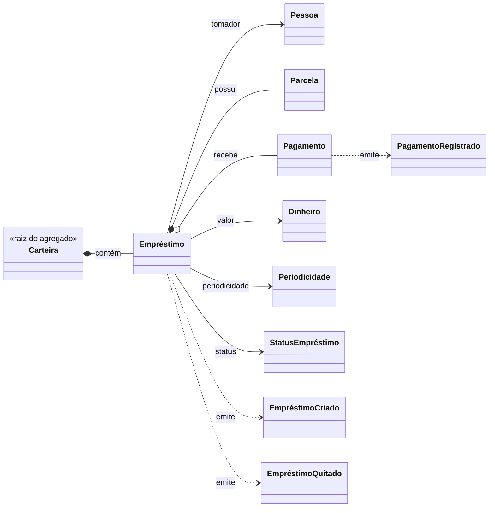

# DOMAIN-001: Aggregate Carteira

> **Versão:** 0.1.0  
> **Status:** Rascunho  
> **Autor(es):** [Nome(s)]  
> **Data de Criação:** 2026-08-01  
> **Última Atualização:** 2026-08-01  
> **Revisor(es):** [Nome(s)]  
> **Aprovação:** [Nome / Cargo / Data]  
> **Foundation Relacionado:** FOUNDATION-[NNN]

---

## 1. Objetivo

> Descreva o propósito deste agregado, o que ele representa no domínio e o problema que resolve.

---

## 2. Responsabilidades

> Liste as responsabilidades deste agregado — o que ele é dono e o que ele garante.

- [Responsabilidade 1]
- [Responsabilidade 2]

---

## 3. Invariantes

> Condições que devem ser verdadeiras a qualquer momento, independentemente do estado em que o agregado se encontra.

| ID | Invariante | Consequência da Violação |
|----|------------|--------------------------|
| AGG-[NNN]-INV-001 | [Descrição da condição] | [Consequência] |

---

## 4. Entidades Filhas

> Entidades que compõem este agregado e vivem dentro de sua fronteira de consistência.

| ID | Entidade | Papel no Agregado | É a Raiz? |
|----|----------|-------------------|----------|
| ENT-[NNN] | [Nome] | [Papel] | Sim/Não |

---

## 5. Value Objects

> Value Objects que compõem este agregado.

| ID | Value Object | Uso no Agregado |
|----|--------------|-----------------|
| VO-[NNN] | [Nome] | [Como é utilizado] |

---

## 6. Eventos

> Domain Events emitidos por este agregado.

| ID | Evento | Significado |
|----|--------|-------------|
| EVT-[NNN] | [Nome] | [O que o evento comunica] |

---

## 7. Regras

> Regras de negócio que governam este agregado.

| ID | Regra | Fonte |
|----|-------|-------|
| BR-[NNN] | [Descrição] | [Foundation/Origem] |

---

## 8. Relacionamentos

> Relacionamentos deste agregado com os demais elementos do domínio.

| Agregado / Elemento | Tipo de Relacionamento | Descrição |
|---------------------|------------------------|-----------|
| [Elemento] | Composição/Agregado/Referência | [Descrição] |

### 8.1 Diagrama do Agregado

---

## 9. Histórico de Versões

| Versão | Data | Autor | Descrição da Mudança |
|--------|------|-------|---------------------|
| 0.1.0 | 2026-08-01 | [Nome] | Criação inicial |
