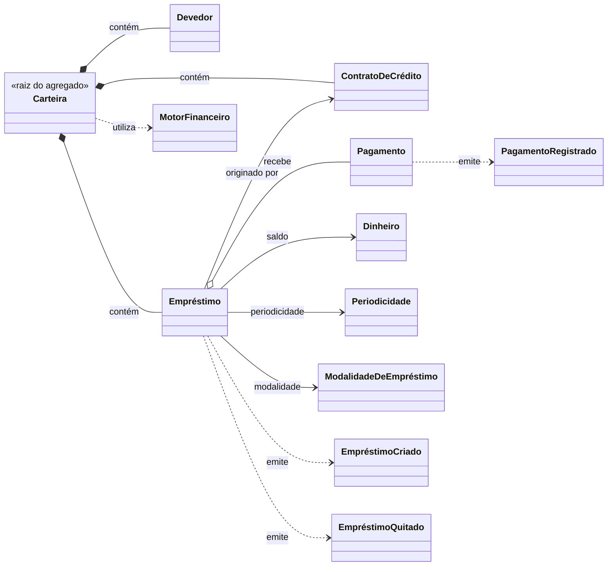

# DOMAIN-001 — Aggregate Carteira

**ID:** DOMAIN-001

**Versão:** 1.1.0

**Status:** Aprovado

---

# 1. Objetivo

A Carteira representa o Aggregate Root do domínio de Operações de Crédito.

Ela é a responsável por garantir a consistência de todas as operações financeiras pertencentes ao Credor.

Toda operação de crédito pertence exatamente a uma Carteira.

Nenhuma entidade deste domínio poderá existir fora de uma Carteira.

---

# 2. Responsabilidades

A Carteira é responsável por:

- manter o conjunto de operações de crédito;
- manter o conjunto de Devedores;
- garantir a unicidade das operações;
- garantir a integridade do Aggregate;
- servir como fronteira transacional do domínio;
- impedir relacionamentos entre operações pertencentes a Carteiras distintas.

A Carteira não executa cálculos financeiros.

Essa responsabilidade pertence exclusivamente ao Motor Financeiro.

---

# 3. Invariantes

## INV-001

Todo Devedor pertence exatamente a uma Carteira.

---

## INV-002

Todo Contrato de Crédito pertence exatamente a uma Carteira.

---

## INV-003

Todo Empréstimo pertence exatamente a uma Carteira.

---

## INV-004

Nenhuma entidade poderá ser compartilhada entre Carteiras.

---

## INV-005

Toda operação financeira deverá respeitar os limites da própria Carteira.

---

# 4. Entidades Filhas

A Carteira é composta pelas seguintes entidades:

- Devedor
- Contrato de Crédito
- Empréstimo
- Pagamento

---

# 5. Value Objects

A Carteira utiliza os seguintes Value Objects:

- Dinheiro
- Periodicidade
- Modalidade de Empréstimo

---

# 6. Domain Services

A Carteira utiliza o seguinte Domain Service:

- Motor Financeiro

---

# 7. Domain Events

A Carteira produz ou participa dos seguintes eventos:

- Empréstimo Criado
- Pagamento Registrado
- Empréstimo Quitado

---

# 8. Relacionamentos

A Carteira estabelece a fronteira de consistência do domínio.

Todas as entidades pertencem exatamente a uma Carteira.

Todo processamento financeiro ocorre dentro dessa fronteira.

O diagrama Mermaid deve representar:

Carteira
│
├── Devedor
├── Contrato de Crédito
├── Empréstimo
│ └── Pagamento
│
├── Dinheiro
├── Periodicidade
├── Modalidade de Empréstimo
│
└── Motor Financeiro

---

# 9. Histórico de Versões

| Versão | Data | Descrição |
|---------|------|-----------|
| 1.1.0 | 23/08/2026 | Parcela removida da composicao, da arvore e do diagrama do agregado: entidade revogada pela DR-004 (IMP-337). |
| 1.0.0 | 01/08/2026 | Primeira versão oficial do Aggregate Carteira. |
