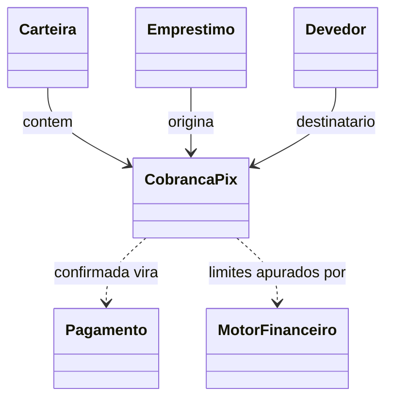

# DOMAIN-031 — Aggregate Cobranca Pix

**ID:** DOMAIN-031

**Versão:** 1.0.0

**Status:** Aprovado

---

# 1. Objetivo

A Cobranca Pix representa **um pedido de pagamento do acerto**, emitido no
provedor externo (Mercado Pago) e correlacionado de volta por um identificador
proprio da TiaNet.

Ela existe porque o acerto e livre: pela DR-004 nao ha parcela para cobrar com
antecedencia, e o valor so passa a existir depois que o Motor apura o trecho.
Cada Pix nasce, portanto, de uma apuracao daquele instante e vale por pouco
tempo.

A Cobranca Pix **nao calcula nada**. Recebe o juro do periodo e a quitacao ja
apurados pelo Motor Financeiro e se recusa a existir fora desse intervalo.

---

# 2. Responsabilidades

A Cobranca Pix e responsavel por:

- conter o valor pedido dentro do que o Motor apurou;
- guardar a validade e recusar expiracao antecipada;
- carregar o `external_reference`, identificador da TiaNet que viaja ate o
  provedor e volta na notificacao;
- registrar o que o provedor devolveu (identificador do pagamento, copia-e-cola
  e QR);
- distinguir o valor **pedido** do valor **recebido**, marcando divergencia sem
  recusar dinheiro que ja entrou;
- garantir que estados terminais nao voltem atras.

A Cobranca Pix **nao** registra pagamento no Motor, nao conhece o provedor e nao
decide se o devedor pode pagar. Quem lanca o pagamento e a camada de aplicacao,
pelo caso de uso existente do Motor Financeiro.

---

# 3. Invariantes

## INV-001

O valor do Pix esta entre o juro do periodo e a quitacao apurados pelo Motor na
data de criacao: `juro_periodo <= valor <= quitacao`.

O piso vem da DR-004 — o devedor deve no minimo o juro do periodo. O teto existe
porque pagar mais que a quitacao nao tem significado no dominio.

---

## INV-002

Estado terminal (`pago`, `expirado`, `cancelado`) nao transiciona — inclusive
para ele mesmo. Um Pix pago nao expira; um Pix expirado nao e pago depois.

O pagamento tardio nao e perdido: ele chega pelo caminho de reconciliacao da
aplicacao, que consulta o provedor antes de expirar (PLAN-045 §3.6).

---

## INV-003

Um Pix so expira **depois** de `expira_em`. Expirar dentro da validade seria
cancelar sem dizer que cancelou.

---

## INV-004

No maximo uma Cobranca Pix `pendente` por Emprestimo.

Invariante de conjunto: o Aggregate sozinho nao a enxerga, e ela e garantida
pelo repositorio com indice unico parcial (`emprestimo_id WHERE
estado='pendente'`). Dois Pix vivos para o mesmo emprestimo produziriam
pagamento duplicado sem que nenhum deles estivesse errado isoladamente.

---

# 4. Entidades Filhas

Nenhuma. A Cobranca Pix e um Aggregate Root simples.

---

# 5. Value Objects

- Dinheiro (valor pedido, valor recebido)
- Estado da Cobranca Pix (`pendente`, `pago`, `expirado`, `cancelado`)
- Origem da Cobranca Pix (`tela`, `copilot_devedor`)

---

# 6. Domain Services

A Cobranca Pix **consome** resultado do Motor Financeiro (juro do periodo e
quitacao), mas nao o invoca: os dois limites chegam como argumento na criacao.

---

# 7. Domain Events

Nesta versao a Cobranca Pix nao emite eventos de dominio. A confirmacao de
pagamento ja produz o evento existente do Motor, ao lancar o Pagamento.

---

# 8. Relacionamentos

- Pertence a exatamente uma Carteira e a exatamente um Emprestimo.
- Referencia o Devedor a quem o Pix foi oferecido.
- Correlaciona-se ao provedor externo por `external_reference` (nosso) e
  `mp_payment_id` (deles) — ver [ADR-021](../../../architecture/adrs/ADR-021-rota-publica-assinada-para-notificacao-de-pagamento.md).
- O Pagamento que nasce da confirmacao pertence ao Motor Financeiro, com
  `origem = pix_mp`.

---

# 9. Histórico de Versões

| Versão | Data | Descrição |
|---------|------|-----------|
| 1.0.0 | 22/09/2026 | Primeira versão. Origem: PLAN-045 (IMP-373), decisão do proprietário em 2026-09-21 sobre recebimento por Pix de valor livre com validade de 60 minutos. |
