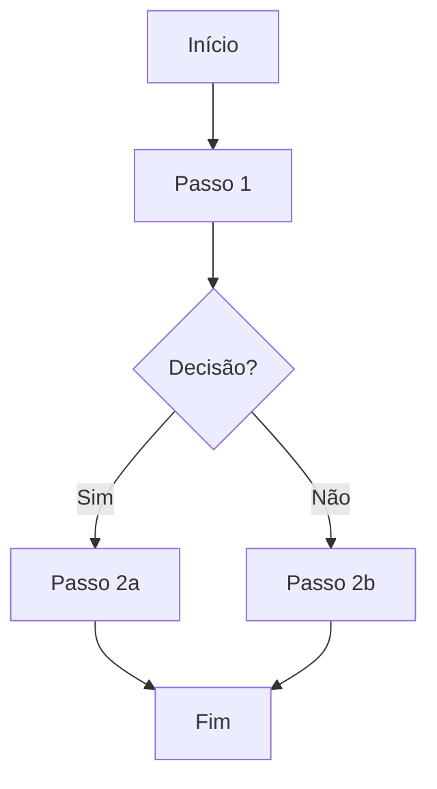

# FOUNDATION-008: Escopo Oficial do MVP

> **Versão:** 0.1.0  
> **Status:** Rascunho  
> **Autor(es):** [Nome(s)]  
> **Data de Criação:** 2026-08-01  
> **Última Atualização:** 2026-08-01  
> **Revisor(es):** [Nome(s)]  
> **Aprovação:** [Nome / Cargo / Data]

---

## 1. Objetivo

> Descreva brevemente o que este documento foundation aborda, por que ele existe e qual problema resolve.

---

## 2. Contexto

> Descreva o contexto de negócio, ambiente e motivação para este foundation.

---

## 3. Contextos do Domínio

> Contextos de negócio que compõem o domínio e suas responsabilidades.

| Contexto | Responsabilidade | Core Domain? |
|----------|------------------|--------------|
| [Contexto 1] | [Responsabilidade] | Sim/Não |

---

## 4. Relação entre os Contextos

> Descreva como os contextos se relacionam e o fluxo principal entre eles.

---

## 5. Definições

> Termos, conceitos e abreviações utilizados neste documento.

| Termo | Definição |
|-------|-----------|
| [Termo 1] | [Definição] |
| [Termo 2] | [Definição] |

---

## 6. Regras de Negócio (quando aplicável)

> Liste as regras, políticas, constraints ou invariantes que regem este domínio.

| ID | Regra | Descrição | Prioridade | Fonte |
|----|-------|-----------|------------|-------|
| BR-001 | [Nome da Regra] | [Descrição detalhada] | Alta/Média/Baixa | [Origem] |
| BR-002 | [Nome da Regra] | [Descrição detalhada] | Alta/Média/Baixa | [Origem] |

---

## 7. Fluxos

> Descreva os fluxos principais (happy path) e alternativos do ponto de vista do negócio.

### 7.1 Fluxo Principal: [Nome do Fluxo]

### 7.2 Fluxos Alternativos / Exceções

| Cenário | Gatilho | Comportamento Esperado |
|---------|---------|------------------------|
| [Cenário 1] | [Gatilho] | [Comportamento] |
| [Cenário 2] | [Gatilho] | [Comportamento] |

---

## 8. Princípios

> Princípios de negócio e diretrizes gerais que orientam este foundation.

- [Princípio 1]
- [Princípio 2]
- [Princípio 3]

---

## 9. Critérios de Aprovação

> Critérios que este foundation deve atender para ser considerado válido.

| ID | Critério | Como Validar |
|----|----------|--------------|
| CF-001 | [Descrição] | [Método] |
| CF-002 | [Descrição] | [Método] |

---

## 10. Histórico de Versões

| Versão | Data | Autor | Descrição da Mudança |
|--------|------|-------|---------------------|
| 0.1.0 | 2026-08-01 | [Nome] | Criação inicial |
