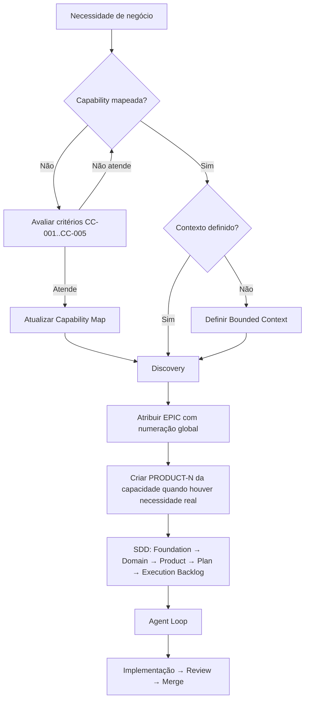

# FOUNDATION-009: Capability Map

**ID:** FOUNDATION-009

**Versão:** 1.1.0

**Status:** Aprovado

**Autor(es):** SDD + Agent Loop Arquitetural

**Data de Criação:** 2026-08-05

**Última Atualização:** 2026-08-11

**Revisor(es):** Arquitetura

**Aprovação:** Arquitetura — 2026-08-05

---

## 1. Objetivo

Este documento formaliza a hierarquia oficial de governança da camada Product:

```
Capability
   ↓
Bounded Context
   ↓
EPIC
   ↓
Feature
   ↓
User Story
```

Ele define todas as capacidades do ecossistema, seus Bounded Contexts, responsabilidades, critérios de evolução e o ciclo de vida que conecta cada elemento ao processo SDD. Serve como **raiz da camada Product**, a fonte única que vincula capacidades a contextos e EPICs, eliminando ambiguidades como a encontrada entre PRODUCT-001 e AMP-001 (registrada no [ROADMAP-ALIGNMENT-001](../architecture/ROADMAP-ALIGNMENT-PRODUCT-AMP.md)).

A hierarquia estabelece que **EPIC ≠ Bounded Context**: o Bounded Context é uma fronteira do domínio; o EPIC é um pacote de entrega dentro de um contexto. Um contexto pode conter múltiplos EPICs.

---

## 2. Contexto

Durante o fechamento do EPIC-001, o Agent Loop identificou conflito de numeração e escopo entre duas fontes oficiais:

- **PRODUCT-001** (Aprovado) enumera 6 EPICs da Capacidade *Administrar Plataforma* (EPIC-002 = Gerenciar Usuários, EPIC-003 = Perfis, EPIC-004 = Permissões, EPIC-005 = Configurações).
- **AMP-001** (Rascunho, 2026-08-04) adota numeração global por evolução de contextos (EPIC-002 = Cadastro de Devedores, EPIC-003 = Comercial/Contratos, EPIC-004 = Empréstimos/Motor, EPIC-005 = Operação Diária, EPIC-006 = IAM).

A decisão arquitetural (ROADMAP-ALIGNMENT-001 §10) determinou:

- AMP-001 como roadmap estratégico; numeração única global.
- Usuários/Perfis/Permissões integram o IAM (EPIC-006).
- EPIC-002 = Cadastro de Devedores.
- **EPIC ≠ Bounded Context** — hierarquia oficial congelada acima.
- Não criar PRODUCT-002/003/004 imediatamente; a arquitetura de capacidades nasce deste documento.

Este FOUNDATION-009 substitui a dupla numeração, mapeia Capacidades → Contextos → EPICs e define as regras de criação e evolução da camada Product.

---

## 3. Conceitos Fundamentais

Os cinco conceitos da hierarquia Product, diferenciados por responsabilidade, granularidade e responsável pela criação:

| Conceito | Responsabilidade | Granularidade | Quem o cria |
|----------|------------------|---------------|-------------|
| **Capability** | Agrupa um conjunto de capacidades de negócio | Muito alta | Arquitetura |
| **Bounded Context** | Delimita um modelo de domínio | Alta | Arquitetura |
| **EPIC** | Pacote de entrega dentro de um contexto | Média | Produto |
| **Feature** | Entrega funcional | Média/baixa | Produto |
| **User Story** | Incremento implementável | Baixa | Produto |

---

## 4. Ciclo de Vida

O nascimento de cada elemento segue o fluxo abaixo, conectando o FOUNDATION-009 ao processo SDD:

```
Capability
   ↓
Bounded Context
   ↓
Discovery
   ↓
EPIC
   ↓
Feature
   ↓
User Story
   ↓
Plan
   ↓
Execution Backlog
   ↓
Implementação
```

Regras de nascimento:

- **Capability e Bounded Context** nascem antes de qualquer EPIC (decisão de Arquitetura).
- **Discovery** precede a criação formal do EPIC e dos documentos Product.
- **EPIC, Feature e User Story** nascem dentro do Bounded Context escolhido, no Discovery.
- **Plan e Execution Backlog** materializam o EPIC para implementação.
- Nenhum elemento pode pular etapas da hierarquia.

---

## 5. Contextos do Domínio

Os Bounded Contexts abaixo são as fronteiras do domínio. Cada contexto é atendido por um ou mais EPICs (pacotes de entrega).

| Contexto | Responsabilidade | Core Domain? | Origem |
|----------|------------------|--------------|--------|
| Platform | Tenant, Usuário, Configuração, isolamento multi-tenant | Não | Existente (EPIC-001) |
| IAM | Autenticação, autorização RBAC, perfis, permissões, identidade | Não | Emergente (EPIC-006) |
| Cadastro | Devedores, histórico cadastral, contatos, documentos | Não | Emergente (EPIC-002) |
| Comercial | Simulações, propostas, análise e aprovação comercial | Não | Emergente |
| Contratos | Formalização, contrato de crédito, assinatura, liberação | Não | Emergente |
| Motor Financeiro | Empréstimos, juros, amortizações, pagamentos, quitação, memória de cálculo | **Sim** | Emergente |
| Cobrança | Recuperação, acordos, promessas, inadimplência | Não | Emergente |
| Agenda | Vencimentos, compromissos, lembretes, retornos | Não | Emergente |
| Comunicação | WhatsApp, SMS, e-mail, histórico de comunicações | Não | Emergente |
| Relatórios | Indicadores, fluxo de caixa, carteira ativa, inadimplência | Não | Emergente |
| Configuracoes Financeiras | Taxas, modalidades, parametros autorizados, vigencia e calendario financeiro | Não | Emergente (EPIC-009) |
| Carteira (Credit) | Aggregate raiz do contexto financeiro; vínculo com Tenant | Não | Existente (estrutura) |
| Billing | Cobrança de uso, assinaturas, faturamento entre tenants | Não | Futuro (pós-MVP) |
| Notification | Canais de comunicação, templates, preferências, filas | Não | Futuro (pós-MVP) |
| Scheduler | Agendamento, cron, batch, workflows temporizados | Não | Futuro (pós-MVP) |
| Workflow | Orquestração de processos de negócio (acordos, aprovações) | Não | Futuro (pós-MVP) |
| Event Bus | Transporte confiável de eventos de domínio (Saga/Outbox) | Não | Futuro (pós-MVP) |
| Search | Índices de consulta para operações, devedores, contratos | Não | Futuro (pós-MVP) |
| AI | Modelos preditivos, scoring, análise de crédito | Não | Futuro (pós-MVP) |
| Integration | Adaptadores para bancos, PIX, registros de dívida, APIs de terceiros | Não | Futuro (pós-MVP) |
| Observability | Métricas, logs, traces, correlation ID, alerting | Não | Futuro (pós-MVP) |
| API Gateway | API pública, rate limiting, documentação, parceiros | Não | Futuro (pós-MVP) |

Nota: `Configuracoes Financeiras` e o nome canonico do contexto para taxas,
modalidades, parametros, vigencia e calendario financeiro. Referencias
historicas a `Configuracoes` nesse sentido devem ser lidas como alias legado,
distintas de `Configuracoes da Plataforma`.

---

## 6. Relação entre os Contextos

### 6.1 Visão geral

```
                    Platform Context
                           │
                           │ customer/supplier
                           ▼
                    Credit Context (Carteira)
                           │
                           ▼
         ┌─────────────────┼─────────────────┐
         ▼                 ▼                 ▼
    Cadastro          Comercial          Contratos
         │                 │                 │
         └─────────────────┴─────────────────┘
                           │
                           ▼
                    Motor Financeiro
                    (Core Domain)
                           │
              ┌────────────┼────────────┐
              ▼            ▼            ▼
          Cobrança      Agenda     Comunicação
              │            │            │
              └────────────┴────────────┘
                           │
                           ▼
                       Relatórios
```

### 6.2 Fluxo principal entre capacidades e contextos

1. **Platform** provê Tenant, Usuário e Configuração (customer/supplier).
2. **IAM** garante identidade, autenticação e autorização para todas as demais.
3. **Cadastro** consome Platform e alimenta **Comercial**.
4. **Comercial** consome Cadastro e alimenta **Contratos**.
5. **Contratos** formaliza a operação que o **Motor Financeiro** processa.
6. **Cobrança, Agenda e Comunicação** reagem aos eventos do Motor Financeiro (downstream, nunca calculam).
7. **Relatórios** consolida dados de todos os contextos.

### 6.3 Regra de relacionamento

- Todo contexto consome Platform/IAM para isolamento e autorização.
- Nenhum downstream calcula juros, saldo ou amortização — essa responsabilidade é exclusiva do Motor Financeiro (Core Domain).

---

## 7. Definições

| Termo | Definição |
|-------|-----------|
| Capability | Capacidade de negócio do produto; unidade de organização do Product Map. |
| Bounded Context | Fronteira do domínio com linguagem e modelo próprios. |
| EPIC | Pacote de entrega dentro de um Bounded Context; pode haver múltiplos EPICs por contexto. |
| Feature | Funcionalidade que pertence a um EPIC. |
| User Story | Requisito atômico que pertence a uma Feature. |
| Core Domain | Contexto que concentra a vantagem competitiva do produto (Motor Financeiro). |
| IAM | Identity and Access Management — identidade, autenticação e autorização. |
| Product Map | FOUNDATION-007 — capacidades funcionais do MVP. |
| Capability Map | Este documento — hierarquia oficial e vínculo Capacidade → Contexto → EPIC. |

---

## 8. Regras de Negócio

| ID | Regra | Descrição | Prioridade | Fonte |
|----|-------|-----------|------------|-------|
| BR-001 | Hierarquia oficial | Toda a camada Product segue `Capability → Bounded Context → EPIC → Feature → User Story`. | Alta | Decisão ROADMAP-ALIGNMENT-001 §10 |
| BR-002 | EPIC ≠ Contexto | EPIC é pacote de entrega; Bounded Context é fronteira do domínio. Um contexto pode conter vários EPICs. | Alta | Decisão ROADMAP-ALIGNMENT-001 §10.2 |
| BR-003 | Numeração única global | A numeração de EPICs é global e estável; numeração local por capacidade é proibida. | Alta | Decisão ROADMAP-ALIGNMENT-001 §10.1 |
| BR-004 | Capacidade como raiz | Nenhum EPIC, Feature ou User Story existe fora de uma capacidade mapeada no Capability Map. | Alta | FOUNDATION-007, Princípio 02 |
| BR-005 | Vínculo EPIC → Contexto | Todo EPIC deve ser atribuído a um único contexto primário. | Alta | Este documento |
| BR-006 | Criação tardia de PRODUCT-N | PRODUCT-N de novas capacidades é criado quando houver necessidade real (Discovery), não antecipadamente. | Alta | Decisão ROADMAP-ALIGNMENT-001 §10.3 |
| BR-007 | Core Domain exclusivo | Cálculos financeiros pertencem exclusivamente ao Motor Financeiro. | Alta | AMP-001 §6.3 |
| BR-008 | Ordem de nascimento | Nenhum elemento pula etapas no ciclo de vida (§4): contexto antes do EPIC, Discovery antes do Product. | Alta | Este documento |
| BR-009 | Configuracoes parametriza | Configuracoes Financeiras define parametros, vigencias e calendario; calculo definitivo permanece exclusivo do Motor Financeiro. | Alta | EPIC-009 Discovery/SDD |

---

## 9. Critérios para Criação de Novas Capabilities

Uma nova Capability nasce somente quando atende, cumulativamente, os seguintes critérios objetivos:

| ID | Critério | Descrição | Como Validar |
|----|----------|-----------|--------------|
| CC-001 | Novo domínio de negócio | A funcionalidade representa um domínio de negócio não coberto por nenhuma Capability existente. | Conferir FOUNDATION-007 e §5 deste documento |
| CC-002 | Linguagem ubíqua própria | O contexto possui vocabulário distinto (entidades, regras e termos próprios). | Glossário de domínio do contexto |
| CC-003 | Ciclo de vida independente | As entidades têm ciclo de vida que não depende do ciclo das capacidades existentes. | Modelagem DDD do contexto |
| CC-004 | Roadmap próprio | A capacidade evolui por um roadmap independente das demais. | ROADMAP-ALIGNMENT-001 + AMP-001 |
| CC-005 | Ownership próprio | Existe um responsável arquitetural e de produto definido para a capacidade. | Decisão de Arquitetura, registrada no handoff |

> Critérios CC-001..CC-005 são **cumulativos**. Ausência de um deles indica que a demanda deve ser absorvida por capacidade existente.

---

## 10. Fluxos

### 10.1 Fluxo Principal: Nascimento de um EPIC



### 10.2 Fluxos Alternativos / Exceções

| Cenário | Gatilho | Comportamento Esperado |
|---------|---------|------------------------|
| Conflito de numeração/escopo | Duas fontes oficiais divergem | Agent Loop para, escala à Arquitetura, registra decisão; não altera documentos oficiais silenciosamente |
| Capacidade fora do Product Map | Nova funcionalidade sem capacidade | Avaliar CC-001..CC-005; se aprovado, atualizar FOUNDATION-009 e FOUNDATION-007 antes de qualquer EPIC |
| EPIC abrange mais de um contexto | Entrega transversal (ex.: IAM) | Definir contexto primário e registrar dependências via conformist/ACL |
| MVP sem documento Product | Demanda de Discovery | Criar PRODUCT-N no início do Discovery, nunca antes |

---

## 11. Princípios

- **Capability é estável; Contexto é a fronteira; EPIC é a entrega.** Modelar cada um no nível correto.
- **A numeração de EPICs é global, única e estável.** Numeração local por capacidade é proibida.
- **A camada Product nasce da raiz (Capability Map).** Nenhum documento Product fica órfão.
- **Contexto ≠ EPIC.** Um contexto pode conter dezenas de EPICs ao longo do tempo.
- **Sem edição silenciosa.** Conflitos entre fontes oficiais escalam à Arquitetura; mudanças em documentos aprovados são erratas versionadas.
- **Criação tardia de documentos Product.** PRODUCT-N nasce quando há necessidade real (Discovery), não por antecipação.
- **Capability nasce por critério objetivo.** Critérios CC-001..CC-005 são cumulativos e determinam o nascimento de uma nova capacidade.

---

## 12. Critérios de Aprovação

| ID | Critério | Como Validar |
|----|----------|--------------|
| CF-001 | Hierarquia oficial Capability → Bounded Context → EPIC → Feature → User Story definida e única | Conferir §8 BR-001/BR-002 e §11 |
| CF-002 | Todos os contextos do domínio mapeados com responsabilidade e core-domain declarados | Conferir §5 contra AMP-001 §4.2/§4.3 |
| CF-003 | Todas as capacidades do FOUNDATION-007 vinculadas a pelo menos um contexto | Validar §6 e o mapa de capacidades |
| CF-004 | Regras de numeração global e de criação tardia de PRODUCT-N explicitadas | Conferir §8 BR-003/BR-006 |
| CF-005 | Critérios de evolução de capacidades e contextos definidos e cumulativos | Conferir §9 (CC-001..CC-005) |
| CF-006 | Conceitos fundamentais diferenciados (Capability, Contexto, EPIC, Feature, US) | Conferir §3 |
| CF-007 | Ciclo de vida conectado ao processo SDD | Conferir §4 contra o fluxo Discovery → SDD → Agent Loop → Implementação |
| CF-008 | docs:validate sem erros | `npm run docs:validate` |

---

## 13. Histórico de Versões

| Versão | Data | Autor | Descrição da Mudança |
|--------|------|-------|---------------------|
| 0.1.0 | 2026-08-05 | SDD + Agent Loop Arquitetural | Criação inicial — hierarquia oficial, mapa de contextos e regras de evolução da camada Product. |
| 1.0.0 | 2026-08-05 | SDD + Agent Loop Arquitetural | Ajustes aprovados pela Arquitetura: tabela de conceitos fundamentais (§3), ciclo de vida conectado ao SDD (§4), critérios objetivos de criação de novas Capabilities (§9) e promoção para Aprovado. |
| 1.1.0 | 2026-08-11 | SDD + Agent Loop Arquitetural | Contexto Configuracoes Financeiras canonizado para EPIC-009, alias legado de Configuracoes declarado e BR-009 adicionada. |
