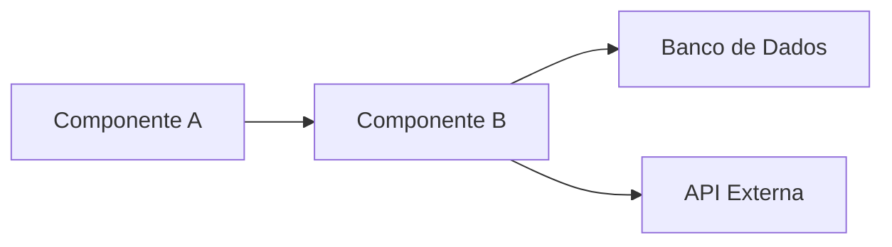

# FEAT-[NNN]: [Nome da Feature]

> **Status:** Proposto | Em Planejamento | Pronto para Desenvolvimento | Em Andamento | Em Code Review | Em Validação | Concluído | Cancelado  
> **Épico Pai:** EPIC-[NNN]  
> **Prioridade:** Crítica | Alta | Média | Baixa  
> **Product Owner:** [Nome]  
> **Tech Lead:** [Nome]  
> **Desenvolvedor(es):** [Nome(s)]  
> **QA:** [Nome]  
> **Data de Criação:** YYYY-MM-DD  
> **Início Previsto:** YYYY-MM-DD  
> **Fim Previsto:** YYYY-MM-DD  
> **Sprint:** [Identificador]  
> **Story Points:** [Valor]  
> **Foundation Relacionado:** [DOC-XXX]  
> **ADRs Relacionados:** [ADR-XXX]

---

## 1. Resumo

> Descrição concisa (1-2 frases) do que esta feature entrega.

---

## 2. Contexto e Motivação

> Por que esta feature é necessária *agora*? Qual problema resolve para o usuário/negócio?

### 2.1 User Story Principal

> **Como** [persona]  
> **Quero** [ação/funcionalidade]  
> **Para** [benefício/valor]

### 2.2 Critérios de Aceitação (ACs)

| ID | Cenário | Dado que | Quando | Então | Prioridade |
|----|---------|----------|--------|-------|------------|
| AC-001 | [Nome] | [Pré-condição] | [Ação] | [Resultado esperado] | Obrigatório |
| AC-002 | [Nome] | [Pré-condição] | [Ação] | [Resultado esperado] | Obrigatório |
| AC-003 | [Nome] | [Pré-condição] | [Ação] | [Resultado esperado] | Desejável |

---

## 3. Especificação Técnica

### 3.1 Arquitetura / Design

> Descreva a abordagem técnica: componentes, APIs, banco de dados, integrações.



### 3.2 Contratos de API (se aplicável)

#### Endpoint: `[MÉTODO] /api/v1/[recurso]`

**Request:**
```json
{
  "campo1": "tipo",
  "campo2": "tipo"
}
```

**Response (200):**
```json
{
  "campo1": "tipo",
  "campo2": "tipo"
}
```

**Códigos de Erro:**
| Código | Significado |
|--------|-------------|
| 400 | [Descrição] |
| 401 | [Descrição] |
| 404 | [Descrição] |
| 500 | [Descrição] |

### 3.3 Modelo de Dados / Migrações

> Alterações no schema, novas tabelas, índices, constraints.

```sql
-- Exemplo de migração
CREATE TABLE [nome_tabela] (
    id UUID PRIMARY KEY DEFAULT gen_random_uuid(),
    [campo] [tipo] NOT NULL,
    created_at TIMESTAMPTZ DEFAULT NOW()
);
```

### 3.4 Configurações / Feature Flags

| Flag | Tipo | Default | Descrição |
|------|------|---------|-----------|
| [flag_name] | boolean | false | [Descrição] |

---

## 4. Interface do Usuário (se aplicável)

### 4.1 Wireframes / Mockups

- [Link para Figma/Arquivo]
- [Referência ao template UX]

### 4.2 Estados da Tela

| Estado | Descrição | Ação do Usuário |
|--------|-----------|-----------------|
| Vazio | [Descrição] | [Ação] |
| Carregando | [Descrição] | — |
| Com Dados | [Descrição] | [Ação] |
| Erro | [Descrição] | [Ação] |

---

## 5. Testes

### 5.1 Cenários de Teste Automatizados

| ID | Tipo | Cenário | Dados de Teste | Resultado Esperado |
|----|------|---------|----------------|-------------------|
| TC-001 | Unit | [Descrição] | [Dados] | [Resultado] |
| TC-002 | Integration | [Descrição] | [Dados] | [Resultado] |
| TC-003 | E2E | [Descrição] | [Dados] | [Resultado] |

### 5.2 Checklist de Qualidade

- [ ] Testes unitários cobrem regras de negócio críticas
- [ ] Testes de integração validam contratos de API
- [ ] Testes E2E cobrem happy path + 1 fluxo alternativo
- [ ] Performance testada (se aplicável)
- [ ] Segurança validada (input validation, auth, etc.)
- [ ] Acessibilidade verificada (se UI)
- [ ] Documentação técnica atualizada

---

## 6. Plano de Deploy e Rollback

### 6.1 Deploy

| Etapa | Ação | Responsável | Validação |
|-------|------|-------------|-----------|
| 1 | [Ação] | [Nome] | [Critério] |
| 2 | [Ação] | [Nome] | [Critério] |

### 6.2 Rollback

> Procedimento para reverter em caso de falha.

- **Gatilho:** [Condição]
- **Ação:** [Passos]
- **Tempo Estimado:** [Minutos/Horas]
- **Validação Pós-Rollback:** [Critério]

---

## 7. Observabilidade

| Métrica / Log / Trace | Descrição | Alerta (se houver) |
|----------------------|-----------|-------------------|
| [Métrica 1] | [Descrição] | [Regra] |
| [Log 1] | [Descrição] | [Regra] |

---

## 8. Dependências

| Feature / Sistema | Tipo | Bloqueia? | Status |
|-------------------|------|-----------|--------|
| [FEAT-XXX / Sistema] | Técnica/Negócio | Sim/Não | [Status] |

---

## 9. Riscos e Mitigações

| Risco | Prob. | Impacto | Mitigação | Responsável |
|-------|-------|---------|-----------|-------------|
| [Risco 1] | Média | Alto | [Ação] | [Nome] |

---

## 10. Histórico de Versões

| Versão | Data | Autor | Mudança |
|--------|------|-------|---------|
| 0.1.0 | YYYY-MM-DD | [Nome] | Criação inicial |

---

## 11. Anexos

- [Link para PR/Commit]
- [Link para documentação de API]
- [Evidências de teste]