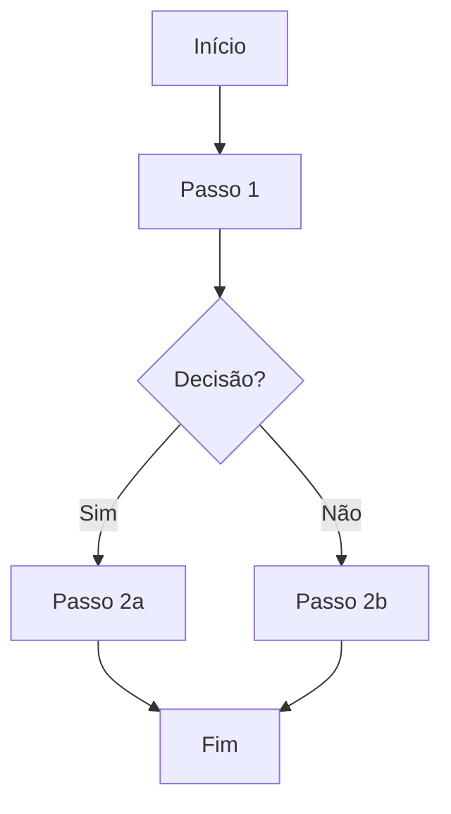

# FEAT-[NNN]: [Nome da Feature]

> **Status:** Proposto | Em Planejamento | Pronto para Desenvolvimento | Em Andamento | Em Validação | Concluído | Cancelado  
> **Épico Pai:** EPIC-[NNN]  
> **Prioridade:** Crítica | Alta | Média | Baixa  
> **Product Owner:** [Nome]  
> **Data de Criação:** YYYY-MM-DD  
> **Início Previsto:** YYYY-MM-DD  
> **Fim Previsto:** YYYY-MM-DD  
> **Sprint:** [Identificador]  
> **Foundation Relacionado:** [DOC-XXX]

---

## 1. Objetivo

> Descrição concisa (1-2 frases) do que esta feature entrega e por que ela existe para o usuário/negócio.

---

## 2. Descrição

> Descrição funcional detalhada do que o usuário pode fazer com esta feature, sem detalhes de implementação técnica.

---

## 3. Fluxo do Usuário

### 3.1 Fluxo Principal: [Nome do Fluxo]

### 3.2 Fluxos Alternativos / Exceções

| Cenário | Gatilho | Comportamento Esperado |
|---------|---------|------------------------|
| [Cenário 1] | [Gatilho] | [Comportamento] |
| [Cenário 2] | [Gatilho] | [Comportamento] |

---

## 4. Regras de Negócio

> Regras funcionais específicas desta feature (as regras gerais do domínio vivem no Foundation).

| ID | Regra | Descrição | Prioridade | Fonte |
|----|-------|-----------|------------|-------|
| FEAT-[NNN]-BR-001 | [Nome da Regra] | [Descrição] | Alta/Média/Baixa | [Foundation/Origem] |
| FEAT-[NNN]-BR-002 | [Nome da Regra] | [Descrição] | Alta/Média/Baixa | [Foundation/Origem] |

---

## 5. Critérios de Aceitação

| ID | Cenário | Dado que | Quando | Então | Prioridade |
|----|---------|----------|--------|-------|------------|
| AC-001 | [Nome] | [Pré-condição] | [Ação] | [Resultado esperado] | Obrigatório |
| AC-002 | [Nome] | [Pré-condição] | [Ação] | [Resultado esperado] | Obrigatório |
| AC-003 | [Nome] | [Pré-condição] | [Ação] | [Resultado esperado] | Desejável |

---

## 6. Dependências Funcionais

> Dependências de negócio/funcionais, não técnicas (dependências de engenharia vivem na camada de Engenharia).

| Feature / Sistema | Tipo | Bloqueia? | Status |
|-------------------|------|-----------|--------|
| [FEAT-XXX / Sistema] | Negócio/Funcional/Externa | Sim/Não | [Status] |

---

## 7. Histórico de Versões

| Versão | Data | Autor | Mudança |
|--------|------|-------|---------|
| 0.1.0 | YYYY-MM-DD | [Nome] | Criação inicial |
