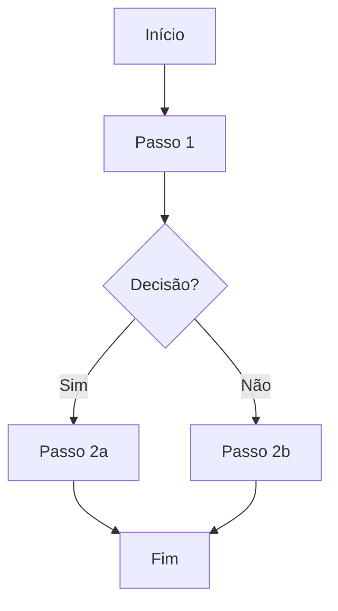

# [Nome do Documento Foundation]

> **Versão:** 0.1.0  
> **Status:** Rascunho | Em Revisão | Aprovado | Obsoleto  
> **Autor(es):** [Nome(s)]  
> **Data de Criação:** YYYY-MM-DD  
> **Última Atualização:** YYYY-MM-DD  
> **Revisor(es):** [Nome(s)]  
> **Aprovação:** [Nome / Cargo / Data]

---

## 1. Contexto e Propósito

> Descreva brevemente o que este documento foundation aborda, por que ele existe e qual problema resolve.

### 1.1 Escopo

- **Inclui:** [Itens dentro do escopo]
- **Exclui:** [Itens fora do escopo]

### 1.2 Stakeholders

| Papel | Nome | Responsabilidade |
|-------|------|------------------|
| Product Owner | | |
| Tech Lead | | |
| UX Designer | | |
| QA Lead | | |

---

## 2. Definições e Terminologia

| Termo | Definição |
|-------|-----------|
| [Termo 1] | [Definição] |
| [Termo 2] | [Definição] |

---

## 3. Regras de Negócio / Políticas

> Liste as regras, políticas, constraints ou invariantes que regem este domínio.

| ID | Regra | Descrição | Prioridade | Fonte |
|----|-------|-----------|------------|-------|
| BR-001 | [Nome da Regra] | [Descrição detalhada] | Alta/Média/Baixa | [Origem] |
| BR-002 | [Nome da Regra] | [Descrição detalhada] | Alta/Média/Baixa | [Origem] |

---

## 4. Modelos de Dados / Entidades

> Descreva as entidades principais, seus atributos e relacionamentos.

### 4.1 Entidade: [Nome da Entidade]

| Atributo | Tipo | Obrigatório | Descrição | Restrições |
|----------|------|-------------|-----------|------------|
| id | UUID | Sim | Identificador único | PK |
| [atributo] | [tipo] | Sim/Não | [descrição] | [regras] |

### 4.2 Relacionamentos

- **[Entidade A]** 1 — N **[Entidade B]**: [Descrição]
- **[Entidade C]** N — M **[Entidade D]**: [Descrição]

---

## 5. Fluxos e Processos

> Descreva os fluxos principais (happy path) e alternativos.

### 5.1 Fluxo Principal: [Nome do Fluxo]

### 5.2 Fluxos Alternativos / Exceções

| Cenário | Gatilho | Comportamento Esperado |
|---------|---------|------------------------|
| [Cenário 1] | [Gatilho] | [Comportamento] |
| [Cenário 2] | [Gatilho] | [Comportamento] |

---

## 6. Requisitos Não-Funcionais

| ID | Categoria | Requisito | Critério de Aceitação |
|----|-----------|-----------|----------------------|
| NFR-001 | Performance | [Descrição] | [Métrica/Valor] |
| NFR-002 | Segurança | [Descrição] | [Métrica/Valor] |
| NFR-003 | Disponibilidade | [Descrição] | [Métrica/Valor] |

---

## 7. Rastreabilidade

| Item Foundation | Épicos Relacionados | Features Relacionadas | ADRs Relacionados |
|-----------------|---------------------|----------------------|-------------------|
| [Seção/Regra] | [EPIC-XXX] | [FEAT-XXX] | [ADR-XXX] |

---

## 8. Histórico de Versões

| Versão | Data | Autor | Descrição da Mudança |
|--------|------|-------|---------------------|
| 0.1.0 | YYYY-MM-DD | [Nome] | Criação inicial |

---

## 9. Anexos e Referências

- [Link para documento relacionado 1]
- [Link para documento relacionado 2]
- [Referência externa]