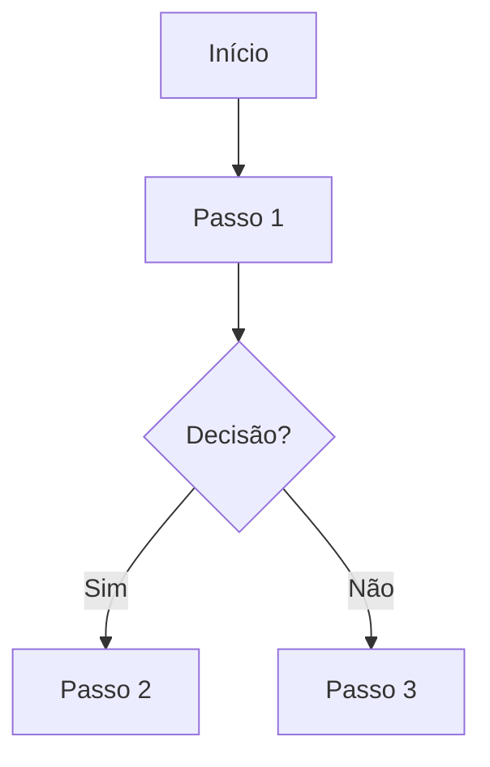
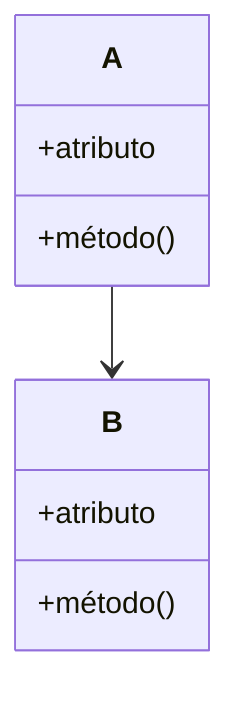
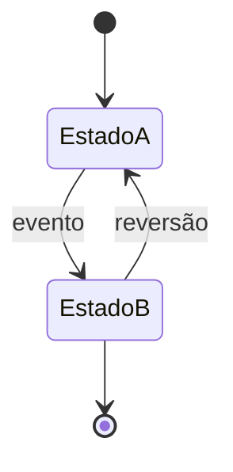
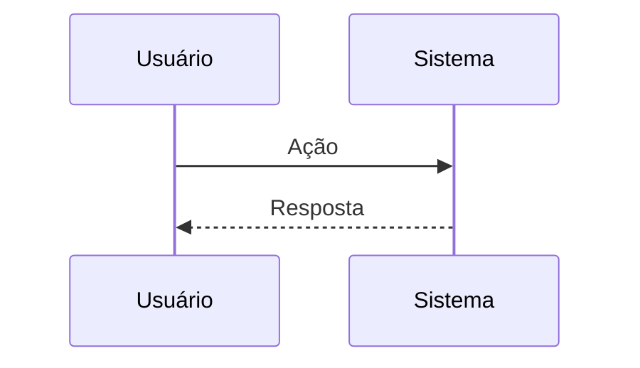

# [ID] — [Título do Diagrama]

> **Versão:** 0.1.0  
> **Status:** Rascunho | Em Revisão | Aprovado | Obsoleto  
> **Autor(es):** [Nome(s)]  
> **Data de Criação:** YYYY-MM-DD  
> **Última Atualização:** YYYY-MM-DD  
> **Revisor(es):** [Nome(s)]  
> **Aprovação:** [Nome / Cargo / Data]  
> **Documento Relacionado:** [DOC-NNN]

---

## 1. Objetivo

> Descreva o que este diagrama comunica e por que ele existe.

---

## 2. Tipo do Diagrama

> Escolha o tipo adequado e justifique a escolha.

| Tipo | Quando Usar | Selecionado? |
|------|-------------|--------------|
| Flowchart | Fluxos de processo, decisões e etapas | Sim/Não |
| Class Diagram | Estrutura de classes e relacionamentos | Sim/Não |
| ER Diagram | Entidades e seus relacionamentos de dados | Sim/Não |
| State Diagram | Estados e transições de um elemento | Sim/Não |
| Sequence Diagram | Interação entre elementos ao longo do tempo | Sim/Não |

**Tipo escolhido:** [Flowchart | Class | ER | State | Sequence]

---

## 3. Código Mermaid

### 3.1 Flowchart (exemplo)



### 3.2 Class Diagram (exemplo)



### 3.3 ER Diagram (exemplo)

```mermaid
erDiagram
    ENTIDADE_A ||--o{ ENTIDADE_B : "relacionamento"
    ENTIDADE_A {
        id PK
        descricao string
    }
    ENTIDADE_B {
        id PK
        entidade_a_id FK
        valor decimal
    }
```

### 3.4 State Diagram (exemplo)



### 3.5 Sequence Diagram (exemplo)



---

## 4. Observações

- [Observação 1]
- [Observação 2]

---

## 5. Histórico de Versões

| Versão | Data | Autor | Descrição da Mudança |
|--------|------|-------|---------------------|
| 0.1.0 | YYYY-MM-DD | [Nome] | Criação inicial |
